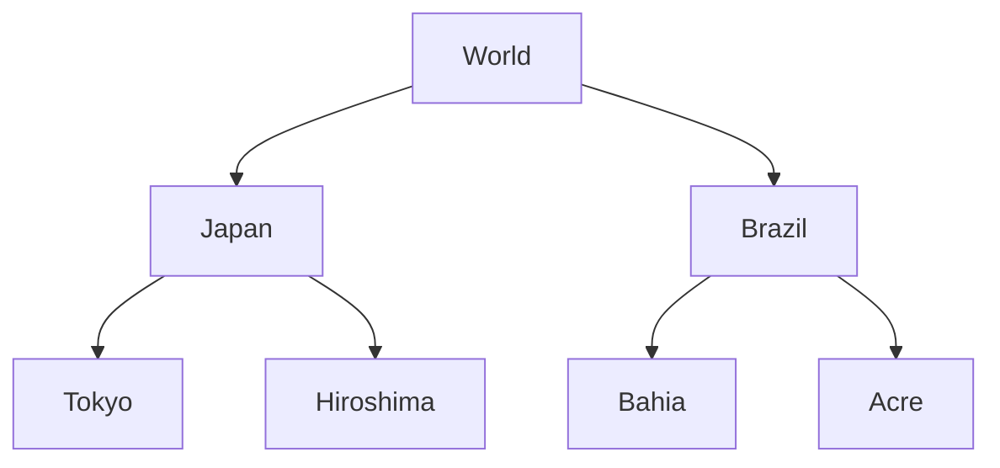
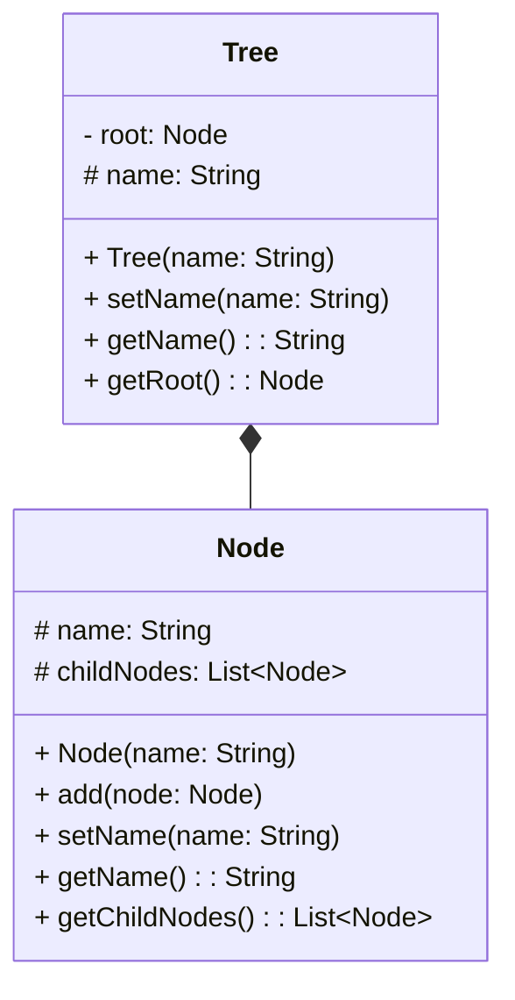
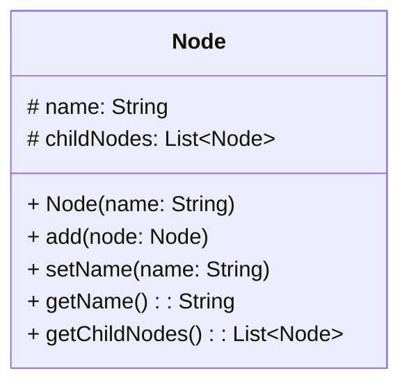
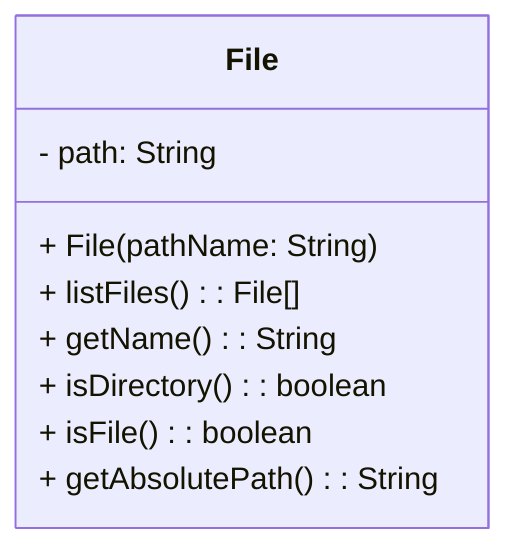

# Composition Design Pattern

## Motivação

O Composite é uma estrutura em árvore que combina objetos simples e compostos. Ela permite que os clientes tratem tanto objetos individuais quanto composições de objetos de forma igual, representando hierarquias de partes e todo.

## Exemplo de Aplicação Prática

Vamos usar como exemplo uma aplicação que deve representar uma hierarquia de nacionalidades, algo mais ou menos assim:



O design pattern composition, funciona mais ou menos assim:



Para implementar o exemplo de uso, vamos criar a classe Node:



```java
package br.com.jorgerabellodev;

import java.util.ArrayList;
import java.util.List;

public class Node {
    protected String name;
    protected List<Node> childNodes;

    public Node(String name) {
        this.name = name;
        this.childNodes = new ArrayList<>();
    }

    public void add(Node node) {
        childNodes.add(node);
    }

    public String getName() {
        return name;
    }

    public void setName(String name) {
        this.name = name;
    }

    public List<Node> getChildNodes() {
        return childNodes;
    }
}

```

Agora vamos implementar a classe Tree:


```java
package br.com.jorgerabellodev;

public class Tree {
    private Node root;
    protected String name;

    public Tree(String name) {
        this.root = new Node(name);
    }

    public String getName() {
        return name;
    }

    public void setName(String name) {
        this.name = name;
    }

    public Node getRoot() {
        return root;
    }
}package br.com.jorgerabellodev;

import java.util.List;

public class Main {
    public static void main(String[] args) {
        Tree tree = new Tree("World");
        Node root = tree.getRoot();

        Node japan = new Node("Japan");
        Node brazil = new Node("Brazil");

        root.add(japan);
        root.add(brazil);

        Node tokyo = new Node("Tokyo");
        Node hiroshima = new Node("Hiroshima");

        japan.add(tokyo);
        japan.add(hiroshima);

        Node bahia = new Node("Bahia");
        Node acre = new Node("Acre");

        brazil.add(bahia);
        brazil.add(acre);

        System.out.println(root.getName());
        List<Node> childNodes = root.getChildNodes();
        childNodes.forEach(node -> {
            System.out.println("\t" + node.getName());
            List<Node> childNodes1 = node.getChildNodes();
            childNodes1.forEach(childNode -> {
                System.out.println("\t\t" + childNode.getName());
            });
        });
    }
}


```

## Execução e Uso

Por fim podemos fazer uso:

```java
package br.com.jorgerabellodev;

import java.util.List;

public class Main {
    public static void main(String[] args) {
        Tree tree = new Tree("World");
        Node root = tree.getRoot();

        Node japan = new Node("Japan");
        Node brazil = new Node("Brazil");

        root.add(japan);
        root.add(brazil);

        Node tokyo = new Node("Tokyo");
        Node hiroshima = new Node("Hiroshima");

        japan.add(tokyo);
        japan.add(hiroshima);

        Node bahia = new Node("Bahia");
        Node acre = new Node("Acre");

        brazil.add(bahia);
        brazil.add(acre);

        System.out.println(root.getName());
        List<Node> childNodes = root.getChildNodes();
        childNodes.forEach(node -> {
            System.out.println("\t" + node.getName());
            List<Node> childNodes1 = node.getChildNodes();
            childNodes1.forEach(childNode -> {
                System.out.println("\t\t" + childNode.getName());
            });
        });
    }
}

```

A saída deve ser algo assim:

```bash
World
    Japan
        Tokyo
        Hiroshima
    Brazil
        Bahia
        Acre
```

## Testes Unitários

```java
package br.com.jorgerabellodev;

import org.assertj.core.api.Assertions;
import org.junit.jupiter.api.*;

import java.util.Arrays;
import java.util.List;

@TestMethodOrder(MethodOrderer.DisplayName.class)
class NodeTest {


    private static Node joao;
    private static Node joaoFilho;
    private static Node joaoFilhoSegundo;

    @BeforeAll
    static void beforeAll() {
        joao = new Node("João");
        joaoFilho = new Node("João Filho");
        joaoFilhoSegundo = new Node("João Filho Segundo");
    }

    @Test
    @DisplayName("Given a new node should add the name to child nodes")
    void givenANewNodeShouldAddTheNameToChildNodes() {

        List<Node> childNodes = joao.getChildNodes();

        List<Node> expectedContent = Arrays.asList(
                new Node("João Filho"),
                new Node("João Filho Segundo")
        );

        Assertions.assertThat(childNodes).isNotNull()
                .isNotEmpty()
                .hasSize(2)
                .hasSameElementsAs(expectedContent);
    }

    @Test
    @DisplayName("Given a new node node should return the node name")
    void givenANewNodeShouldReturnTheNodeName() {

        Assertions.assertThat(joao.getName()).isNotNull()
                .isNotEmpty()
                .isEqualTo("João");
    }


    @Test
    @DisplayName("Given a new node should add the child nodes and get his content")
    void givenANewNodeShouldAddTheChildNodesAndGetHisContent() {
        joao.add(joaoFilho);
        joao.add(joaoFilhoSegundo);

        List<Node> childNodes = joao.getChildNodes();

        Node node = childNodes.stream()
                .findFirst()
                .isPresent() ? childNodes.stream().findFirst().get() : null;

        Assertions.assertThat(node).isNotNull();

        Assertions.assertThat(node.getName()).isNotNull()
                .isEqualTo("João Filho");
    }
}
```

```java
package br.com.jorgerabellodev;

import org.assertj.core.api.Assertions;
import org.junit.jupiter.api.DisplayName;
import org.junit.jupiter.api.MethodOrderer;
import org.junit.jupiter.api.Test;
import org.junit.jupiter.api.TestMethodOrder;

import java.util.List;

@TestMethodOrder(MethodOrderer.DisplayName.class)
class TreeTest {

    @Test
    @DisplayName("Given a new tree shoud return root name name")
    void givenANewTreeShoudReturnRootName() {

        Tree tree = new Tree("People");

        Node root = tree.getRoot();

        Assertions.assertThat(root.getName()).isNotNull()
                .isEqualTo("People");

        Assertions.assertThat(root).isNotNull();
    }

    @Test
    @DisplayName("Given a root should add nodes and return them")
    void givenARootShouldAddNodesAndReturnThem() {
        Tree tree = new Tree("People");
        Node root = tree.getRoot();

        Node parents = new Node("Parents");
        Node uncles = new Node("Uncles");

        root.add(parents);
        root.add(uncles);

        Node marcio = new Node("Marcio");
        Node maria = new Node("Maria");

        Node joao = new Node("João");
        Node pedro = new Node("Pedro");

        parents.add(marcio);
        parents.add(maria);

        uncles.add(joao);
        uncles.add(pedro);

        List<Node> childNodes = root.getChildNodes();

        Node node = childNodes.stream()
                .findFirst()
                .isPresent() ? childNodes.stream().findFirst().get() : null;

        Assertions.assertThat(childNodes).isNotNull()
                .isNotEmpty()
                .hasSize(2);

        Node expectedNode = new Node("Parents");
        expectedNode.add(new Node("Marcio"));
        expectedNode.add(new Node("Maria"));

        Assertions.assertThat(node).isNotNull()
                .isEqualTo(expectedNode);
    }
}

```

## Caso de Uso

Vamos a um exemplo de caso de uso.

Imagine uma aplicação onde exista a necessidade de implementar uma funcionalidade em que precisamos ler arquivos de forma recursiva em diretórios específicos.

Sendo assim teremos uma implementação mais ou menos assim:



Essa implementação se refere a classe [`File`](https://docs.oracle.com/javase/8/docs/api/java/io/File.html) do pacote `java.io`.

Sendo assim podemos utilizar essa classe da seguinte forma:

```java
package br.com.jorgerabellodev;

import java.io.File;

public class FileUsage {

    private static String level = "";

    public static void main(String[] args) {
        showAllDirectories("/home/seujorge/Documents");
    }

    private static void showAllDirectories(String pathToSearch) {
        File path = new File(pathToSearch);
        File[] items = path.listFiles();
        for (int i = 0; items != null && i < items.length; i++) {
            File file = items[i];
            if (file.isFile()) {
                System.out.println(level + file.getName());
            } else if (file.isDirectory()) {
                System.out.println(level + file.getName());
                level += "---";
                showAllDirectories(file.getAbsolutePath());
                level = level.substring(0, level.lastIndexOf("---"));
            }
        }
    }
}

```

## Exemplos de Possíveis Testes Unitários

```java
package br.com.jorgerabellodev;

import org.assertj.core.api.Assertions;
import org.junit.jupiter.api.DisplayName;
import org.junit.jupiter.api.MethodOrderer;
import org.junit.jupiter.api.Test;
import org.junit.jupiter.api.TestMethodOrder;

import java.io.File;

@TestMethodOrder(MethodOrderer.DisplayName.class)
class FileTest {

    @Test
    @DisplayName("Dado um path deve recuperar items nele")
    void dadoUmPathDeveRecuperarOsArquivosNele() {
        File path = new File("/home/seujorge/Documents");
        File[] items = path.listFiles();

        Assertions.assertThat(items).isNotNull()
                .isNotEmpty();
    }

    @Test
    @DisplayName("Dado um path deve identificar se um item é um diretório")
    void dadoUmPathDeveidentificarSeUmNoEUmDiretorio() {
        File path = new File("/home/seujorge/Documents");

        File[] items = path.listFiles();

        File item = items[0];

        Assertions.assertThat(item.isDirectory()).isTrue();

    }

    @Test
    @DisplayName("Dado um path deve identificar se um item é um arquivo")
    void dadoUmPathDeveidentificarSeUmNoEUmArquivo() {
        File path = new File("/home/seujorge/Documents");

        File[] items = path.listFiles();

        File item = items[0];

        Assertions.assertThat(item.isDirectory()).isTrue();

    }
}

```

## Código
<https://bitbucket.org/jorge_rabello/composition/src/master/>
