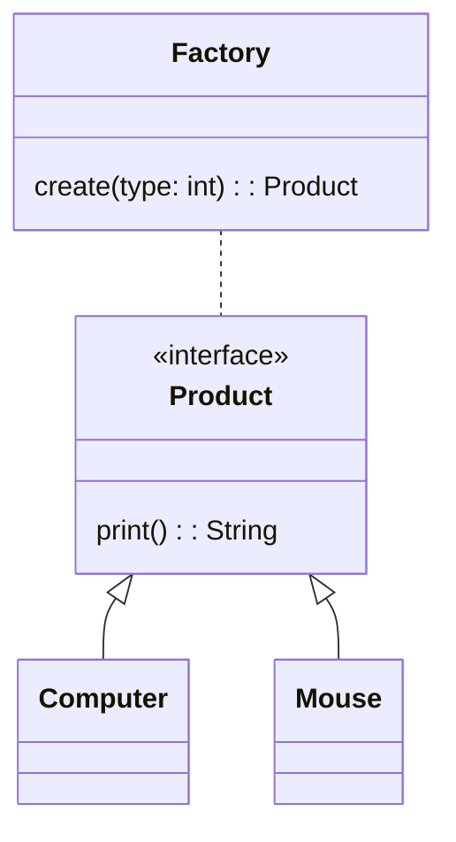
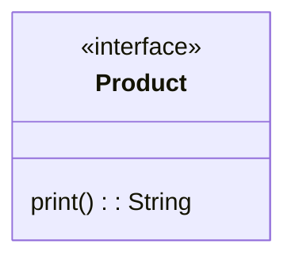
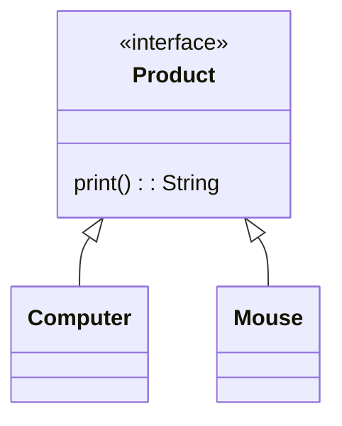
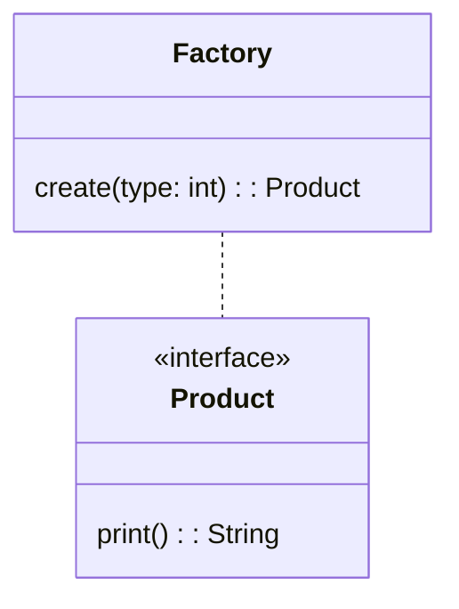
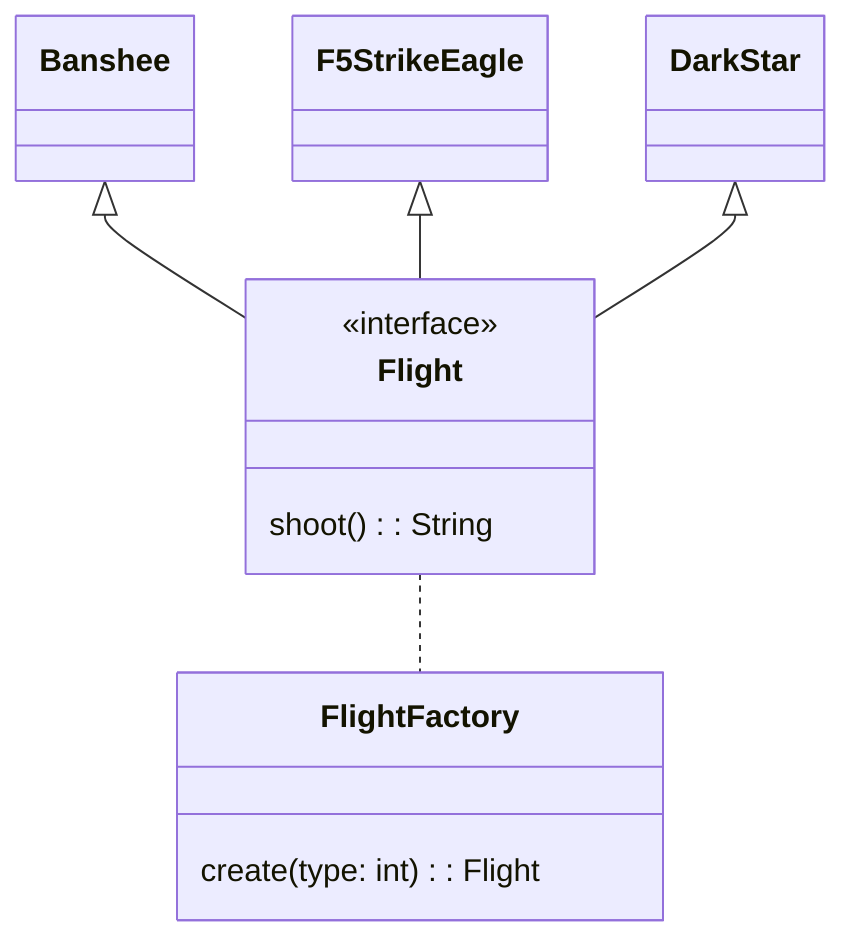
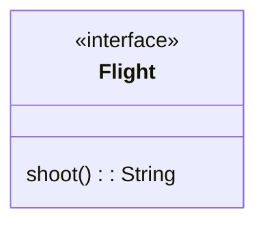
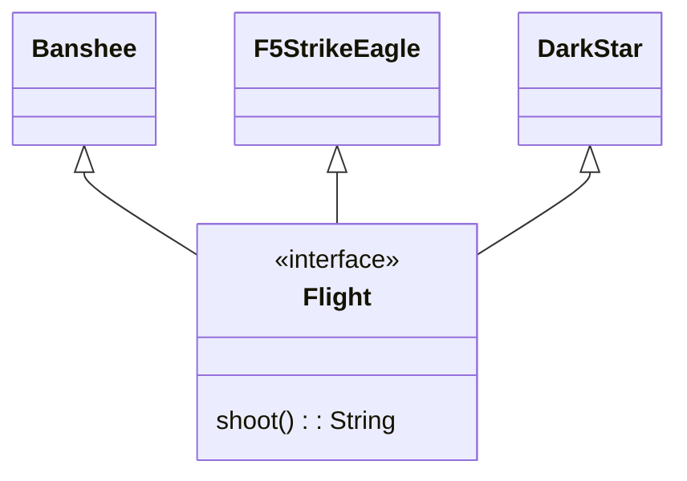
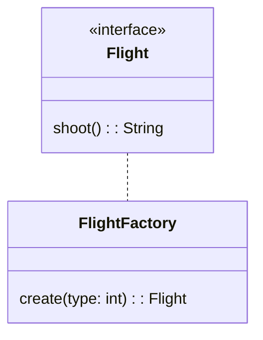

# Factory Design Pattern

## Motivação

O design pattern Factory cria uma instância a partir de diversas classes derivadas.

Uma das formas de implementar é criando uma interface para a criação dos objetos, mas devemos deixar as implementações decidirem qual classe instanciar.

O design pattern Factory permite a uma classe diferir a instanciação de sub classes.

## Exemplo de Aplicação Prática

Vamos imagina que temos uma lojinha onde podemos criar produto a partir de uma favotry, sendo assim teremos algo mais ou menos assim:



Vamos iniciar criando a interface `Product`



```java
package br.com.jorgerabello.factory;

public interface Product {
    String print();
}

```

Vamos criar agora as representações de produtos, que devem implementar a interface `Product`



```java
package br.com.jorgerabello.factory;

public class Mouse implements Product {
    @Override
    public String print() {
        return "A mouse";
    }
}

```

```java
package br.com.jorgerabello.factory;

public class Computer implements Product {
    @Override
    public String print() {
        return "A simple computer !";
    }
}

```

O próximo passo é implementar a classe `Factory` essa classe será responsável por criar (fabricar) os objetos, que nesse caso são produtos.

Note que toda a lógica de como criar um produto deve ser encapsulada na factory.



```java
package br.com.jorgerabello.factory;

public class Factory {
    public static Product create(int type) {
        Product product = null;
        switch (type) {
            case 0:
                product = new Computer();
                break;
            case 1:
                product = new Mouse();
                break;
            default:
                System.err.println("Produto não cadastrao");
        }
        return product;
    }
}

```

## Execução e Uso

Por fim podemos executar esse código a fim de demonstar sua utilização.

```java
package br.com.jorgerabello.factory;

public class Main {
    public static void main(String[] args) {
        Product product = Factory.create(0);
        System.out.println(product.print());

        Product product1 = Factory.create(1);
        System.out.println(product1.print());
    }
}

```

```shell
> Task :Main.main()
A simple computer !
A mouse

BUILD SUCCESSFUL in 202ms
2 actionable tasks: 2 executed
01:32:27: Execution finished ':Main.main()'.
```


## Testes Unitários

```java
package br.com.jorgerabello.factory;

import org.assertj.core.api.Assertions;
import org.junit.jupiter.api.DisplayName;
import org.junit.jupiter.api.MethodOrderer;
import org.junit.jupiter.api.Test;
import org.junit.jupiter.api.TestMethodOrder;

@TestMethodOrder(MethodOrderer.DisplayName.class)
class FactoryTest {

    @Test
    @DisplayName("Deve retornar um produto do tipo mouse")
    void deveRetornarUmProdutoDoTipoMouse() {
        Product product = Factory.create(1);
        String productDescription = product.print();

        Assertions.assertThat(productDescription).isEqualTo("A mouse");
    }

    @Test
    @DisplayName("Deve retornar um produto do tipo computador")
    void deveRetornarUmProdutoDoTipoComputador() {
        Product product = Factory.create(0);
        String productDescription = product.print();

        Assertions.assertThat(productDescription).isEqualTo("A simple computer !");
    }


    @Test
    @DisplayName("Deve retornar nulo quando o produto não existir")
    void deveRetornarNuloQuandoUmProdutoNaoExistir() {
        Product product = Factory.create(5);
        Assertions.assertThat(product).isNull();
    }
}

```

## Caso de Uso

Vamos imaginar um novo joguinho, onde dessa vez podemos escolher um tipo de avião para jogar, por tanto, precisaremos de uma rotina capaz de criar diversos tipos de aviões.

Vamos solucionar esse problema utilizando o design pattern Factory.

Teremos de desenhar algo mais ou menos assim:



Para iniciar o exemplo então, vamos criar a interface, chamada `Flight` essa interface deverá, ter o comportamento de atirar de cada avião, representada pelo método `shoot()`.





```java
package br.com.jorgerabello.factory;

public interface Flight {
    String shoot();
}

```

Note mais uma vez que a interface serve apenas para definir os comportamentos dos objetos que serão criados.

Agora vamos definir os objetos que implementam a interface `Flight`, no nosso exemplo os aviões:



```java
package br.com.jorgerabello.factory;

public class Banshee implements Flight {
    @Override
    public String shoot() {
        return "Banshee fire the laser";
    }
}

```

```java
package br.com.jorgerabello.factory;

public class DarkStar implements Flight {
    @Override
    public String shoot() {
        return "DarkStar fire a powerfull shot";
    }
}

```

```java
package br.com.jorgerabello.factory;

public class F5StrikeEagle implements Flight {
    @Override
    public String shoot() {
        return "Strike Eagle fire the missile";
    }
}

```

Por fim vamos definir a factory, onde devem ser encapsuladas as regras para criar os aviões:



```java
package br.com.jorgerabello.factory;

public class FlightFactory {
    public static Flight create(int type) {
        Flight flight = null;
        switch (type) {
            case 0:
                flight = new Banshee();
                break;
            case 1:
                flight = new F5StrikeEagle();
                break;
            case 2:
                flight = new DarkStar();
                break;
            default:
                System.err.println("Avião não disponível");
        }
        return flight;
    }
}

```
## Exemplos de Possíveis Testes Unitários

```java
package br.com.jorgerabello.factory;

import org.assertj.core.api.Assertions;
import org.junit.jupiter.api.DisplayName;
import org.junit.jupiter.api.MethodOrderer;
import org.junit.jupiter.api.Test;
import org.junit.jupiter.api.TestMethodOrder;

@TestMethodOrder(MethodOrderer.DisplayName.class)
class FlightFactoryTest {

    @Test
    @DisplayName("Should get the banshee shooting")
    void shouldGetTheBansheeShooting() {
        Flight flight = FlightFactory.create(0);
        String message = flight.shoot();

        Assertions.assertThat(message).isEqualTo("Banshee fire the laser");
    }

    @Test
    @DisplayName("Should get the F5 Strike Eagle shooting")
    void shouldGetTheF5StrikeEagleShooting() {
        Flight flight = FlightFactory.create(1);
        String message = flight.shoot();

        Assertions.assertThat(message).isEqualTo("Strike Eagle fire the missile");
    }

    @Test
    @DisplayName("Should get the DarkStar shooting")
    void shouldGetTheDarkStarShooting() {
        Flight flight = FlightFactory.create(2);
        String message = flight.shoot();

        Assertions.assertThat(message).isEqualTo("DarkStar fire a powerfull shot");
    }


    @Test
    @DisplayName("Given an inexistent flight should be null")
    void givenAnInexistentFlightShouldBeNull() {
        Flight flight = FlightFactory.create(100);

        Assertions.assertThat(flight).isNull();
    }

}

```

## Código
https://bitbucket.org/jorge_rabello/factory/src/master/