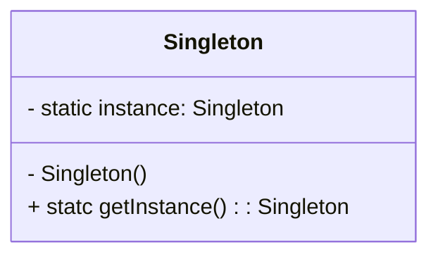
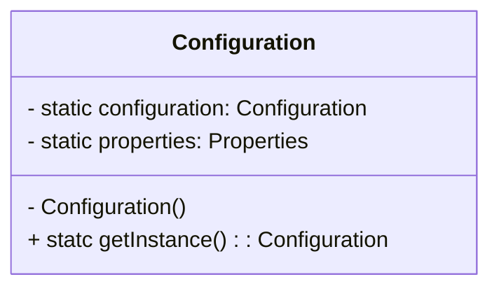
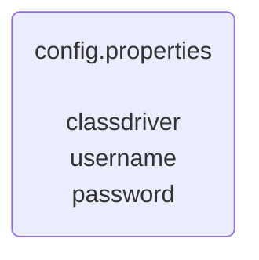

# Singleton Design Pattern

## Motivação

Singleton é uma classe a qual somente uma única instância pode exister. O objetivo aqui é garantir que uma classe tenha apenas uma instância e apenas um ponto de acesso global.


## Exemplo de Aplicação Prática



Sendo assim a implementação seria algo do tipo:

```java
package br.com.jorgerabellodev.singleton;

public final class Singleton {

    private static Singleton instance;

    private Singleton() {

    }

    public static Singleton getInstance() {
        if (instance == null) {
            instance = new Singleton(); // teremos apenas uma instância
        }
        return instance;
    }
}

```

## Execução e Uso

```java
package br.com.jorgerabellodev.singleton;

public class Main {
    public static void main(String[] args) {

        Singleton firstSingleton = Singleton.getInstance();
        Singleton secondSingleton = Singleton.getInstance();

        // note que se referem ao mesmo endereço
        System.out.println(firstSingleton);
        System.out.println(secondSingleton);

        // logo serão iguais ao serem comparados com equals()
        System.out.println(firstSingleton.equals(secondSingleton));
        System.out.println(secondSingleton.equals(firstSingleton));
    }
}

```

## Testes Unitários

```java
package br.com.jorgerabellodev.singleton;

import org.assertj.core.api.Assertions;
import org.junit.jupiter.api.DisplayName;
import org.junit.jupiter.api.MethodOrderer;
import org.junit.jupiter.api.Test;
import org.junit.jupiter.api.TestMethodOrder;

@TestMethodOrder(MethodOrderer.DisplayName.class)
class SingletonTest {

    @Test
    @DisplayName("Deve haver apenas uma instância do singleton")
    void deveHaverApenasUmaInstanciaDoSingleton() {
        Singleton firstInstance = Singleton.getInstance();
        Singleton secondInstance = Singleton.getInstance();

        boolean isEquals = firstInstance.equals(secondInstance);

        Assertions.assertThat(isEquals).isTrue();
    }
}

```
Note também que como o contrutor é privado, fica impossível instanciar um Singleton com `new Singleton()` por exemplo. A única forma de se conseguir uma instância é por meio do método estático `getInstance()`, que por sua vez sempre vai checar se o deve ou não criar uma nova instância.

## Caso de Uso

Vamos imaginar uma aplicação onde temos uma classe de configurações e esa classe de configurações deve ler as configurações do arquivo `config.properties` localizado no projeto. 

Queremos que haja apenas uma instância de configuração e logo, para tal, vamos implementar o design pattern singleton.






Primeiro crie o arquivo `config.properties` em `/src/main/resources/config.properties`, com o seguinte conteúdo:

```
classDriver=jdbc:mysql://localhost/dbname?userUnicode=true&characterEncoding=utf8
username=yourUsername
password=yourSecretPassword
```

Agora vamos implementar a classe que lê esse arquivo de configurações, utilizando o design pattern Singleton.

```java
package br.com.jorgerabellodev.singleton;

import java.io.IOException;
import java.io.InputStream;
import java.util.Properties;

public class Configuration {
    private static Configuration configuration;
    private static Properties properties;

    private Configuration() {
        try {
            if (properties == null) {
                properties = new Properties();
                InputStream resourceAsStream = this.getClass().getResourceAsStream("/config.properties");
                properties.load(resourceAsStream);
            }
        } catch (IOException exception) {
            exception.printStackTrace();
        }
    }

    public static Configuration getInstance() {
        if (configuration == null) {
            configuration = new Configuration(); // single instance
        }
        return configuration;
    }

    public static String get(String key) {
        return properties.getProperty(key);
    }
}

```

## Exemplos de Possíveis Testes Unitários

```java
package br.com.jorgerabellodev.singleton;

import org.assertj.core.api.Assertions;
import org.junit.jupiter.api.DisplayName;
import org.junit.jupiter.api.MethodOrderer;
import org.junit.jupiter.api.Test;
import org.junit.jupiter.api.TestMethodOrder;

@TestMethodOrder(MethodOrderer.DisplayName.class)
class ConfigurationTest {

    @Test
    @DisplayName("Deve haver apenas uma instância do singleton de configuração")
    void deveHaverApenasUmaInstanciaDoSingleton() {

        Configuration firstInstance = Configuration.getInstance();
        Configuration secondInstance = Configuration.getInstance();

        boolean isEquals = firstInstance.equals(secondInstance);

        Assertions.assertThat(isEquals).isTrue();
    }

    @Test
    @DisplayName("Dado que as instâncias são iguais devem sempre recuperar os mesmos dados")
    void dadoQueAsInstanciasSaoIguaisDevemSempreRecuperarOsMesmosDados() {
        Configuration firstInstance = Configuration.getInstance();
        Configuration secondInstance = Configuration.getInstance();

        String firstClassDriver = firstInstance.get("classDriver");
        String firstUserName = firstInstance.get("username");
        String firstPassword = firstInstance.get("password");

        String secondClassDriver = secondInstance.get("classDriver");
        String secondUserName = secondInstance.get("username");
        String secondPassword = secondInstance.get("password");

        Assertions.assertThat(firstClassDriver).isEqualTo(secondClassDriver);
        Assertions.assertThat(firstUserName).isEqualTo(secondUserName);
        Assertions.assertThat(firstPassword).isEqualTo(secondPassword);
    }
}

```

## Código

https://bitbucket.org/jorge_rabello/singleton/src/master/