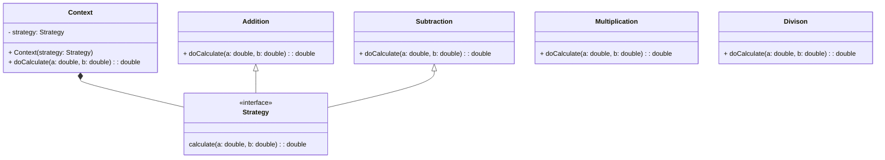
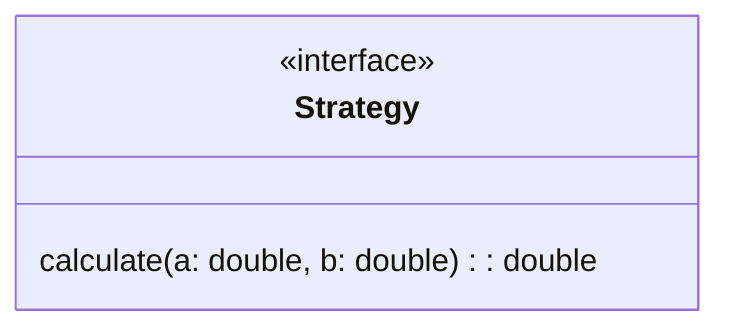
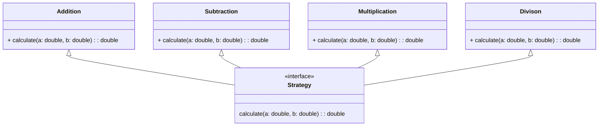
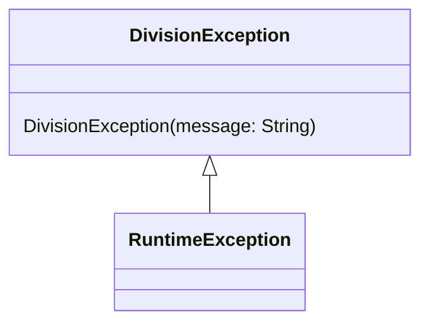
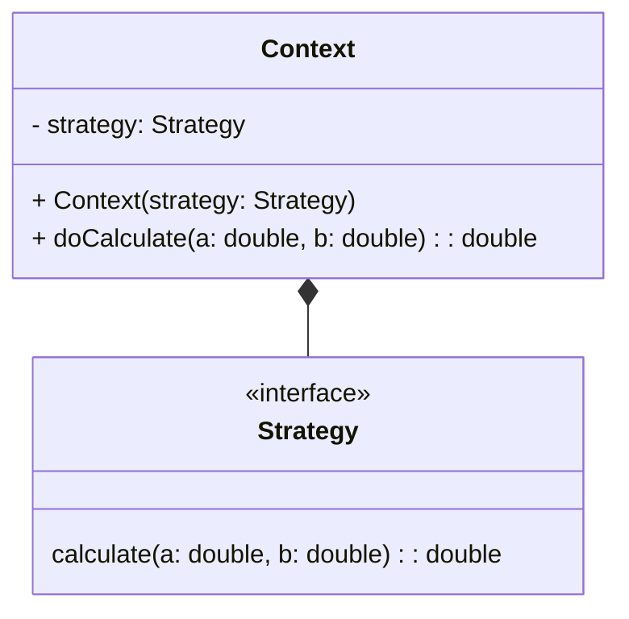
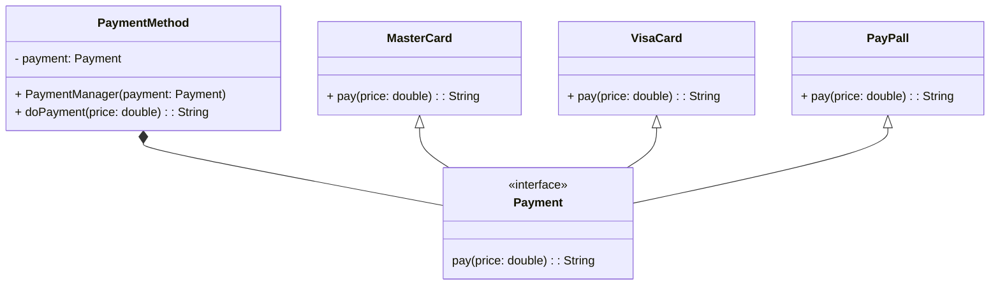
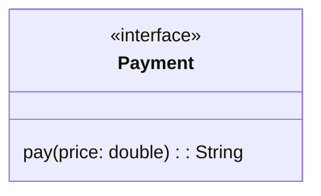
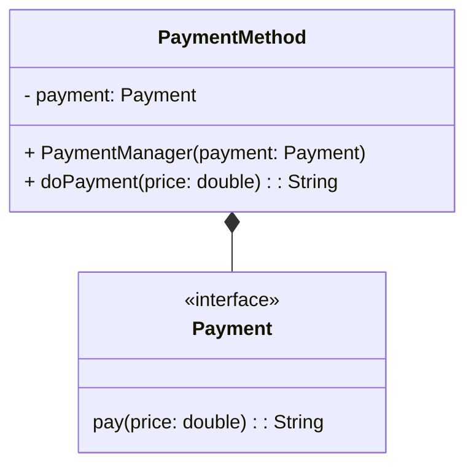
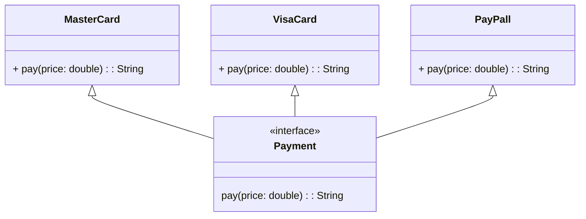

# Strategy Design Pattern

## Motivação

O design pattern strategy encapsula um algoritmo em uma classe. 

Para implementar defina uma família de algorítmos, encapsule cada um deles e faça com que eles sejam intercambiáveis. 

O design pattern strategy permite variar o algoritmo independente do cliente que o utiliza.

## Exemplo de Aplicação Prática

Vamos desenvolver uma calculadora que deve realizar quatro operações básicas:

* Adição
* Subtração
* Multiplicação
* Divisão

---

---

Por tanto a primeira coisa que vamos fazer é criar uma interface que deve representar a estratégia a ser utilizada:




```java
package br.com.jorgerabellodev.strategy.strategies;

public interface Strategy {
    double calculate(double a, double b);
}

```

O próximo passo é criar as classes que representam as operações, essas classes devem implementar a interface Strategy:



```java
package br.com.jorgerabellodev.strategy.strategies;

public final class Addition implements Strategy {
    @Override
    public double calculate(double a, double b) {
        System.out.print(a + " + " + b + " = ");
        return a + b;
    }
}

```

```java
package br.com.jorgerabellodev.strategy.strategies;

public final class Subtraction implements Strategy {
    @Override
    public double calculate(double a, double b) {
        System.out.print(a + " - " + b + " = ");
        return a - b;
    }
}

```

```java
package br.com.jorgerabellodev.strategy.strategies;

public final class Multiplication implements Strategy {
    @Override
    public double calculate(double a, double b) {
        System.out.print(a + " * " + b + " = ");
        return a * b;
    }
}

```

```java
package br.com.jorgerabellodev.strategy.strategies;

import br.com.jorgerabellodev.strategy.exceptions.DivisionException;

public final class Division implements Strategy {
    @Override
    public double calculate(double a, double b) {
        if (b <= 0) {
            throw new DivisionException("O divisor deve ser maior que zero !");
        }
        System.out.print(a + " / " + b + " = ");
        return a / b;
    }
}

```

Para o caso da divisão vamos criar uma exception que deve ser lançada quando for passado um divisor menor ou igual a zero:



```java
package br.com.jorgerabellodev.strategy.exceptions;

public class DivisionException extends RuntimeException {
    public DivisionException(String message) {
        super(message);
    }
}

```

No nosso próximo passo, vamos implementar uma classe que representa um determinado contexto, essa classe em seu construtor deve receber a interface `Strategy`, assim ao instanciar um contexto, poderemos passar qualquer classe que implemente a interface `Strategy`, repare que aqui estamos nos valendo do poder do polimorfismo:



```java
package br.com.jorgerabellodev.strategy.strategies;

public class Context {
    private final Strategy strategy;

    public Context(Strategy strategy) {
        this.strategy = strategy;
    }

    public double doCalculate(double a, double b) {
        return this.strategy.calculate(a, b);
    }
}

```


## Execução e Uso

Feito isso, podemos simplesmente executar as operações da seguinte forma:

```java
package br.com.jorgerabellodev.strategy;

import br.com.jorgerabellodev.strategy.strategies.*;

public class Main {
    public static void main(String[] args) {

        Context additionContext = new Context(new Addition());

        Context subtractionContext = new Context(new Subtraction());

        Context multiplicationContext = new Context(new Multiplication());

        Context divisionContext = new Context(new Division());

        System.out.println(additionContext.doCalculate(10, 2));
        System.out.println(subtractionContext.doCalculate(10, 2));
        System.out.println(multiplicationContext.doCalculate(10, 2));
        System.out.println(divisionContext.doCalculate(10, 2));
    }
}

```

## Testes Unitários

Agora vamos implementar alguns testes unitários, demonstrando o funcionamento da implementação:

```java
package br.com.jorgerabellodev.strategy.strategies;

import br.com.jorgerabellodev.strategy.exceptions.DivisionException;
import org.assertj.core.api.Assertions;
import org.junit.jupiter.api.Test;

import static org.junit.jupiter.api.Assertions.assertThrows;

class ContextTest {

    @Test
    void givenAnAdditionStrategyShouldReturnTheAdditionResult() {
        Context additionContext = new Context(new Addition());

        double result = additionContext.doCalculate(10, 2);

        Assertions.assertThat(result).isEqualTo(12);
    }

    @Test
    void givenASubtractionStrategyShouldReturnTheSubtractionResult() {
        Context subtractionContext = new Context(new Subtraction());

        double result = subtractionContext.doCalculate(10, 2);

        Assertions.assertThat(result).isEqualTo(8);
    }

    @Test
    void givenAMultiplicationStrategyShouldReturnTheMultiplicationResult() {
        Context multiplicationContext = new Context(new Multiplication());

        double result = multiplicationContext.doCalculate(10, 2);

        Assertions.assertThat(result).isEqualTo(20);
    }

    @Test
    void givenADivisionStrategyShouldReturnTheDivisionResult() {
        Context divisionContext = new Context(new Division());

        double result = divisionContext.doCalculate(10, 2);

        Assertions.assertThat(result).isEqualTo(5);
    }

    @Test
    void givenADivisionStrategyUsingAZeroDivisorShouldThrowDivisionException() {
        Context divisionContext = new Context(new Division());

        DivisionException divisionException = assertThrows(DivisionException.class, () -> divisionContext.doCalculate(10, 0));

        Assertions.assertThat(divisionException.getMessage()).isEqualTo("O divisor deve ser maior que zero !");
    }
}

```

## Caso de Uso

Vamos imaginar que você esteja desenvolvendo parte de um software de e-commerce, e que seja possível pagar as compras realizadas com tipos de pagamentos diferentes, sendo eles:

* MasterCard
* VisaCard
* PayPall

----

---

Primeiramente vamos criar a interface que representa um pagamento:



```java
package br.com.jorgerabellodev.strategy.strategies;

public interface Payment {
    String pay(double price);
}

```

Na sequência, vamos criar uma classe chamada `PaymentMethod` essa classe será responsável por aplicar as regras de pagamento, conforme o contexto:



```java
package br.com.jorgerabellodev.strategy.strategies;

public class PaymentMethod {
    private final Payment payment;

    public PaymentMethod(Payment payment) {
        this.payment = payment;
    }

    public String doPay(double price) {
        return payment.pay(price);
    }
}


```

Nosso próximo passo é criar as classes que representam os pagamentos, lembre-se que essas classes devem implementar a interface `Payment`:



```java
package br.com.jorgerabellodev.strategy.strategies;

public class MasterCard implements Payment {
    @Override
    public String pay(double price) {
        return "Pay " + price + " using MasterCard";
    }
}


```

```java
package br.com.jorgerabellodev.strategy.strategies;

public class VisaCard implements Payment {
    @Override
    public String pay(double price) {
        return "Pay " + price + " using VisaCard";
    }
}

```

```java
package br.com.jorgerabellodev.strategy.strategies;

public class PayPall implements Payment {
    @Override
    public String pay(double price) {
        return "Pay " + price + " using PayPall";
    }
}

```

Agora podemos executar, utilizando a implementação:

```java
package br.com.jorgerabellodev.strategy;

import br.com.jorgerabellodev.strategy.strategies.MasterCard;
import br.com.jorgerabellodev.strategy.strategies.PayPall;
import br.com.jorgerabellodev.strategy.strategies.PaymentMethod;
import br.com.jorgerabellodev.strategy.strategies.VisaCard;

import java.util.Scanner;

public class Main {
    public static void main(String[] args) {
        Scanner teclado = new Scanner(System.in);

        System.out.println("You need tp pay $25 for mobile phone");

        System.out.println("Please select payment method");
        System.out.println("1: MasterCard");
        System.out.println("2: VisaCard");
        System.out.println("3: PayPall");

        int option = teclado.nextInt();

        PaymentMethod paymentManager = null;

        switch (option) {
            case 1 -> paymentManager = new PaymentMethod(new MasterCard());
            case 2 -> paymentManager = new PaymentMethod(new VisaCard());
            case 3 -> paymentManager = new PaymentMethod(new PayPall());
            default -> System.err.println("ERROR: You need to select a valid payment method");
        }

        System.out.println(paymentManager.doPay(25));
    }
}

```

Como de costume vamos implementar os testes:

```java
package br.com.jorgerabellodev.strategy.strategies;

import org.assertj.core.api.Assertions;
import org.junit.jupiter.api.DisplayName;
import org.junit.jupiter.api.MethodOrderer;
import org.junit.jupiter.api.Test;
import org.junit.jupiter.api.TestMethodOrder;

@TestMethodOrder(MethodOrderer.DisplayName.class)
class PaymentMethodTest {

    @Test
    @DisplayName("Given a master card payment method should return \"Pay 35.0 using MasterCard\" Message")
    void givenAMasterCardPaymentMethodShouldReturnPay35UsingMasterCardMessage() {

        PaymentMethod masterCardPaymentMethod = new PaymentMethod(new MasterCard());

        String message = masterCardPaymentMethod.doPay(35);

        Assertions.assertThat(message).isEqualTo("Pay 35.0 using MasterCard");
    }

    @Test
    @DisplayName("Given a visa card payment method should return \"Pay 35.0 using VisaCard\" Message")
    void givenAVisaCardPaymentMethodShouldReturnPay35UsingVisaCardMessage() {

        PaymentMethod visaCardPaymentMethod = new PaymentMethod(new VisaCard());

        String message = visaCardPaymentMethod.doPay(35);

        Assertions.assertThat(message).isEqualTo("Pay 35.0 using VisaCard");
    }

    @Test
    @DisplayName("Given a pay pall payment method should return \"Pay 35.0 using PayPall\" Message")
    void givenAVisaCardPaymentMethodShouldReturnPay35UsingPayPallMessage() {

        PaymentMethod payPallPaymentMethod = new PaymentMethod(new PayPall());

        String message = payPallPaymentMethod.doPay(35);

        Assertions.assertThat(message).isEqualTo("Pay 35.0 using PayPall");
    }
}

```

## Código

[Código No BitBucket](https://bitbucket.org/jorge_rabello/strategy/src/master/)