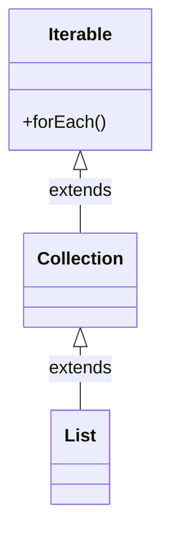

## Defaut Methods

Repare que utilizamos o método `forEach()` acima, invocando ele a partir de uma `List`, porém se você for olhar a interface `java.util.List` verá que lá não tem nenhum método `forEach()`, isso acontece por que esse método está declarado na interface `java.lang.Iterable`.

Isso foi feito assim, pois se não todo mundo que um dia implementou um `List` teria seus código quebrados, pois seriam obrigados a implementar também esse método. Como `List`, herda de `Collection` e essa herda de `Iterable` então podemos invovar o `forEach()`.



Além disso bibliotecas que tem implementações de `List` como é o caso do `Hibernate` também sofreriam com o _breaking change_.

Porém se simplesmente tivessem acrescentado o método `forEach()` na interface `Collection`, todo mundo que herda deveria implementar, e por que isso não acontece ? Vamos dar uma olhadinha no código do `forEach()`:

```java
public interface Iterable<T> {

    ...

    default void forEach(Consumer<? super T> action) {
        Objects.requireNonNull(action);
        for (T t : this) {
            action.accept(t);
        }
    }
}
```

Opa, opa, opa !!! Como assim, um método de interface com implementação ? Sim !!! É isso que faz com que o breaking change não cause efeitos colaterais, note o modificar `default` antes da declaração do método.

Esses são os default methods, e foi uma necessidade cria-los para poder evoluir a JDK sem causar muito transtorno a coisas já solidamente implementadas.

Note que o `forEach()` espera receber como argumento uma implementação de uma interface funcional chamada `Consumer<T>` que por sua vez possui apenas um método abstrato chamado `accept()` que recebe o tipo parametrizado `T` e faz o que você quiser com ele.

Se você realmente prestou atenção, deve ter notado que o tempo todo eu falei que `Consumer<T>` possui apenas um método abstrato, porém se você leu o código fonte da interface, notou que ela tem outros métodos que são default methods, dito isso, entendemos que uma interface funcional pode ter mais de um método desde que eles sejam dafult methods, como por exemplo o default methodo `andThen()`

```java
@FunctionalInterface
public interface Consumer<T> {

    void accept(T t);

    default Consumer<T> andThen(Consumer<? super T> after) {
        Objects.requireNonNull(after);
        return (T t) -> { accept(t); after.accept(t); };
    }
}
```

Esse método pode ser utilizado para compor instâncias da interface `Consumer` como no exemplo a seguir:

```java
import java.util.Arrays;
import java.util.List;
import java.util.function.Consumer;

public class Main {
    public static void main(String[] args) {

        Piloto senna = new Piloto("Ayrton Senna", 1000);
        Piloto prost = new Piloto("Alain Prost", 10);
        Piloto gasly = new Piloto("Pierre Gasly", 908);

        List<Piloto> pilotos = Arrays.asList(senna, prost, gasly);

        Consumer<Piloto> exibirMensagem = piloto -> System.out.println("\nOlá ");

        Consumer<Piloto> exibirNome = piloto -> System.out.println(piloto.getNome());

        pilotos.forEach(exibirMensagem.andThen(exibirNome));
    }
}
```

Falando nisso, sobre a interface `Collection`, ela também recebeu _default methods_ dentre eles um bem interessante que é o `removeIf()`, vamos ver como ele funciona.

Esse método recebe um predicado, que nada mais é do que uma condicional para que se execute algo.

Vamos a um código de exemplo para demonstrar seu uso, primeiro vamos criar uma lista de frutas

```java
import java.util.ArrayList;
import java.util.List;
import java.util.function.Predicate;

public class Main {
    public static void main(String[] args) {
        List<String> fruits = new ArrayList<>();

        fruits.add("maçã");
        fruits.add("banana");
        fruits.add("abacaxi");
        fruits.add("pera");
        fruits.add("uva");
    }
}
```

Agora vamos criar um predicado

```java
import java.util.ArrayList;
import java.util.List;
import java.util.function.Predicate;

public class Main {
    public static void main(String[] args) {
        List<String> fruits = new ArrayList<>();

        fruits.add("maçã");
        fruits.add("banana");
        fruits.add("abacaxi");
        fruits.add("pera");
        fruits.add("uva");


        Predicate<String> predicado = new Predicate<String>() {
            @Override
            public boolean test(String s) {
                return s.contains("r");
            }
        };
    }
}
```

E por fim aplicar esse predicado à lista passando ele como argumento do método `removeIf()`

```java
import java.util.ArrayList;
import java.util.List;~


        Predicate<String> predicado = new Predicate<String>() {
            @Override
            public boolean test(String s) {
                return s.contains("r");
            }
        };

        fruits.removeIf(predicado);
        fruits.forEach(fruit -> System.out.println(fruit));
    }
}
```

Após a execução do `removeIf()` todas as frutas que contém a letra "r" serão removidas da lista.

Note que utilizamos `ArrayList` e não `Arrays.asList()` isso por que a segunda é uma lista imutável e não permitiria a remoção de um item.

Esse mesmo código poderia ser reescrito utilizando lambdas da seguinte forma:

```java
import java.util.ArrayList;
import java.util.List;
import java.util.function.Predicate;

public class Main {
    public static void main(String[] args) {
        List<String> fruits = new ArrayList<>();

        fruits.add("maçã");
        fruits.add("banana");
        fruits.add("abacaxi");
        fruits.add("pera");
        fruits.add("uva");


        Predicate<String> predicado = s -> s.contains("r");

        fruits.removeIf(predicado);
        fruits.forEach(System.out::println);
    }
}
```

Note que temos uma implementação mais enxuta.

Agora que você entendeu como um predicado funciona, vamos para algo mais utilizado na vida real.

Tenha em mente a nossa classe `Piloto` escrita acima e seguinte código:

```java
package br.com.jorgerabellodev;

import br.com.jorgerabellodev.domain.model.Piloto;

import java.util.ArrayList;
import java.util.List;

public class Main {
    public static void main(String[] args) {

        Piloto senna = new Piloto("Ayrton Senna", 100);
        Piloto prost = new Piloto("Alain Prost", 10);
        Piloto gasly = new Piloto("Pierre Gasly", 690);

        List<Piloto> pilotos = new ArrayList<>();

        pilotos.add(senna);
        pilotos.add(prost);
        pilotos.add(gasly);

    }
}
```

Agora imagine que desejamos excluir da lista todos os usuário com menos de 100 pontos.

Então vamos construir um predicado e aplicar ele utilizando o `removeIf()`

```java
package br.com.jorgerabellodev;

import br.com.jorgerabellodev.domain.model.Piloto;

import java.util.ArrayList;
import java.util.List;
import java.util.function.Predicate;

public class Main {
    public static void main(String[] args) {

        Piloto senna = new Piloto("Ayrton Senna", 100);
        Piloto prost = new Piloto("Alain Prost", 10);
        Piloto gasly = new Piloto("Pierre Gasly", 690);

        List<Piloto> pilotos = new ArrayList<>();

        pilotos.add(senna);
        pilotos.add(prost);
        pilotos.add(gasly);


        Predicate<Piloto> pilotosComMenosDe100Pontos = new Predicate<Piloto>() {
            @Override
            public boolean test(Piloto piloto) {
                return piloto.getPontuacao() < 100;
            }
        };

        pilotos.removeIf(pilotosComMenosDe100Pontos);

        pilotos.forEach(piloto -> System.out.println(piloto));
    }
}
```

O código cima ainda pode ser resumido utilizando lambdas

```java
package br.com.jorgerabellodev;

import br.com.jorgerabellodev.domain.model.Piloto;

import java.util.ArrayList;
import java.util.List;
import java.util.function.Predicate;

public class Main {
    public static void main(String[] args) {

        Piloto senna = new Piloto("Ayrton Senna", 100);
        Piloto prost = new Piloto("Alain Prost", 10);
        Piloto gasly = new Piloto("Pierre Gasly", 690);

        List<Piloto> pilotos = new ArrayList<>();

        pilotos.add(senna);
        pilotos.add(prost);
        pilotos.add(gasly);


        Predicate<Piloto> predicate = piloto -> piloto.getPontuacao() < 100;

        pilotos.removeIf(predicate);

        pilotos.forEach(System.out::println);
    }
}
```

**ATENÇÃO**: Os default methods foram criados para que fosse possível que interfaces pudessem evoluir sem quebrar código existente. Eles não foram criados para permitr herança múltipla ou mixins. O que eu quero dizer com isso é que não há herança multipla ou compartilhamento de estado.

Nesse artigo vimos um pouco sobre funções lambda e entendemos um pouco como elas funcionam ! Espero que seja últil, vamos seguir com os próximos artgios, onde vou publicar sobre a API de streams e a API de datas !