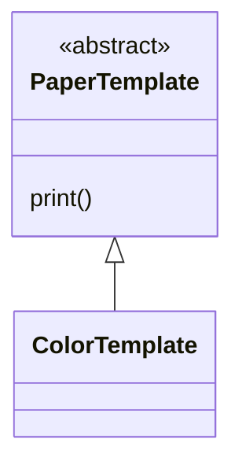
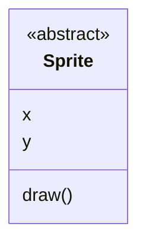
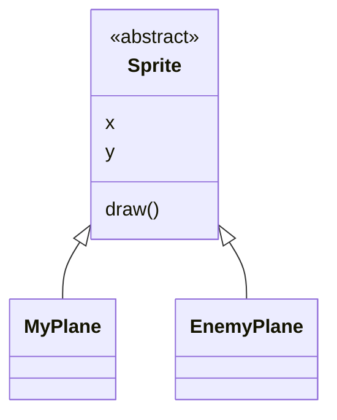

# Design Patterns: Template Pattern

## Motivação

O Template Pattern por meio do uso de Template Method, permite a nós redefinir partes de um algorítmo sem necessariamente alterar a sua estrutura.

## Exemplo de Aplicação Prática

Para exemplificar, vamos imaginar uma classe abstrata que representa um papel de impressão, e vamos utilizar o template pattern para alterar a cor desse papel.

Sendo assim teremos algo, mais ou menos assim:



Primeiramente vamos definir uma classe abstrata chamada `PaperTemplate` para ser nosso template inicial:

```java
public abstract class PaperTemplate {

    public void print() {
        System.out.println("Print A4 Paper");
    }
}

```

Agora vamos criar uma segunda classe que herda de `PaperTemplate` essa classe será chamada de `ColorTemplate` e terá a responsabilidade de alterar a cor do papel.

```java
package br.com.jorgerabellodev.templatepattern;

public class ColorTemplate  extends PaperTemplate {
    @Override
    public void print() {
        super.print();
        System.out.println("Set the color of A4 paper red");
    }
}

```

Note que na classe `ColorTemplate` nós fazemos uma chamada ao método `print()` da classe pai, garantindo assim a sua execução.

## Execução e Uso

Para utilizar basta instanciar a classe `ColorTemplate` e chamar o método print.
```java
package br.com.jorgerabellodev.templatepattern;

public class Main {
    public static void main(String[] args) {
        ColorTemplate colorTemplate = new ColorTemplate();
        colorTemplate.print();
    }
}

```

```shell
> Task :Main.main()
Print A4 Paper
Set the color of A4 paper red

BUILD SUCCESSFUL in 4s
2 actionable tasks: 2 executed
00:27:26: Execution finished ':Main.main()'.
```

## Caso de Uso

Vamos imaginar um joguinho de combate aéreo, onde exista na tela apenas sua nave e a nave do seu inimigo, o objetivo é destruir seu inimigo, antes de ser destruído e as naves são igual.

A questão é: Como posicionar sua nave em um ponto da tela, e a nave do seu inimigo em outro ponto ?

Para solucionar esse problema vamos utilizar o Template Pattern:

Primeiramente vamos modelar a nave sob uma classe abstrata chamada `Sprite`, essa classe vai servir para representar tanto a sua aeronave, quando a do seu inimigo.



Após isso vamos criar duas classes chamadas `MyPlane` e `EnemyPlane` essas classes devem herdar de `Sprite`.



Sendo assim vamos implementar esse código e demonstrar sua utilização:

Primeramente a classe abstrata `Sprite`

```java
package br.com.jorgerabellodev.templatepattern;

public abstract class Sprite {

    private int x;
    private int y;

    public abstract void draw();

    public int getX() {
        return x;
    }

    public void setX(int x) {
        this.x = x;
    }

    public int getY() {
        return y;
    }

    public void setY(int y) {
        this.y = y;
    }
}

```

Agora vamos implementar as classes seguintes:

```java
package br.com.jorgerabellodev.templatepattern;

public class MyPlane extends Sprite {
    @Override
    public void draw() {
        System.out.println("My plane from the bottom of screen: x = "
                + this.getX()
                + " and y = " + this.getY());
    }
}

```

```java
package br.com.jorgerabellodev.templatepattern;

public class EnemyPlane extends Sprite {
    @Override
    public void draw() {
        System.out.println("Enemy plane from the top of screen: x = "
                + this.getX()
                + " and y = " + this.getY());
    }
}

```

Note que cada classe que herda de sprite, implementa o método `draw()` conforme necessário, aqui estamos mais uma vez tirando proveito do polimorfismo.

Por fim podemos executar esses códigos:

```java
package br.com.jorgerabellodev.templatepattern;

public class Main {
    public static void main(String[] args) {
        Sprite myPlane = new MyPlane();
        myPlane.setX(100);
        myPlane.setY(300);
        myPlane.draw();

        Sprite enemyPlane = new EnemyPlane();
        enemyPlane.setX(0);
        enemyPlane.setY(300);
        enemyPlane.draw();
    }
}

```

```shell
> Task :Main.main()
My plane from the bottom of screen: x = 100 and y = 300
Enemy plane from the top of screen: x = 0 and y = 300

BUILD SUCCESSFUL in 220ms
2 actionable tasks: 2 executed
01:01:07: Execution finished ':Main.main()'.
```

## Código
https://bitbucket.org/jorge_rabello/template_pattern/src/master/