## Introdução

Olá esse é o primeiro de uma série de artigos onde pretendo demonstrar o funcionamento do docker.

Inicialmente vou começar por toda a teoria que envolve o funcionamento do docker e de containers para que você entenda bem os próximos passos.

Esse artigo não possui partes práticas, apenas teóricas, deixarei as partes práticas para os próximos, então boa leitura.

## O que são containers ?

Resposta genérica:

"Um container Docker é uma unidade de software leve e isolada que contém todos os elementos necessários para executar um aplicativo, incluindo o código, as bibliotecas, as dependências e as configurações. Ele utiliza a tecnologia de virtualização em nível de sistema operacional para fornecer um ambiente consistente e portátil, independentemente do sistema em que está sendo executado. Os containers Docker são fáceis de implantar, mover e escalar, o que os torna populares para o desenvolvimento e a implantação de aplicativos em diferentes ambientes de computação."

## Sobre Sistemas Operacionais Processos e Namespaces

Os sistemas operacionais evoluíram com a incorporação do conceito de "namespace". Essa propriedade isola processos ou conjuntos de processos, possibilitando o uso de containers. Em suma, os namespaces são responsáveis por essa separação.

Em resumo, os namespaces podem ser representados mais ou menos assim:

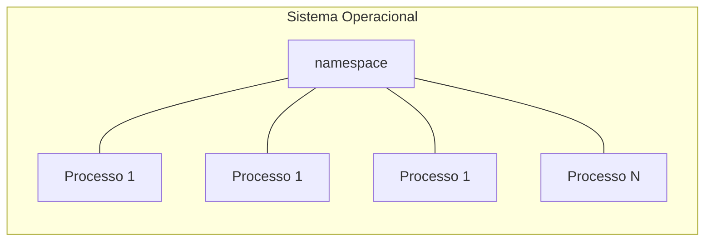

Note que esses processos filhos são isolados graças aos namespaces.

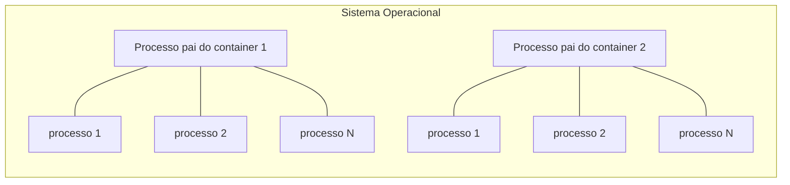

Ao executar um container, é possível enganar o sistema operacional subjacente, fazendo-o pensar que está executando em seu próprio sistema operacional. Isso ocorre porque o container é isolado dos processos do sistema operacional em que está sendo executado. No sistema operacional, há diferentes tipos de processos, como os PID, que são números usados para identificá-los. Além disso, os namespaces permitem separar usuários, processos de rede e sistemas de arquivos, isolando esses componentes uns dos outros.

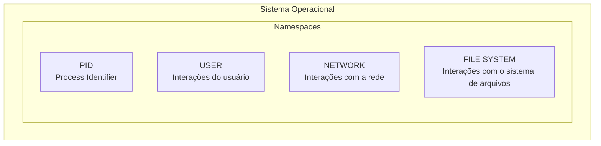

Um container é um processo em execução no sistema operacional que possui seus próprios subprocessos, permitindo a emulação de um sistema operacional completo, sendo executado de forma isolada. Os containers são processos do sistema operacional que emulam sistemas operacionais, tendo seus próprios subprocessos graças aos namespaces.

## O que são CGroups ?

Outro pilar em relação aos conainers, são os chamados `Cgroups`.

Os "Cgroups" controlam os recursos computacionais do container, evitando que ele afete os recursos da máquina hospedeira. Eles garantem o isolamento e o controle dos recursos do container, mesmo em casos de vazamento de memória ou consumo excessivo de recursos.

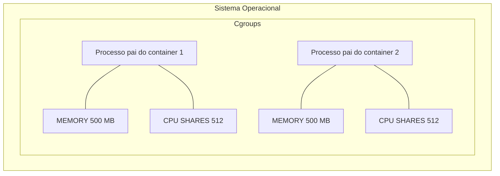

## OSF (Overlay File System)

O sistema de arquivos é um terceiro pilar dos containers. Eles utilizam um sistema chamado "OFS" (Overlay File System). O container em execução é um processo do sistema operacional.

Os containers são baseados em três pilares principais:

- Namespaces: Isolamento de processos.

- Cgroups: Controle de recursos.

- Sistema de Arquivos: OFS (Overlay File System), que representa a forma como o sistema de arquivos funciona.

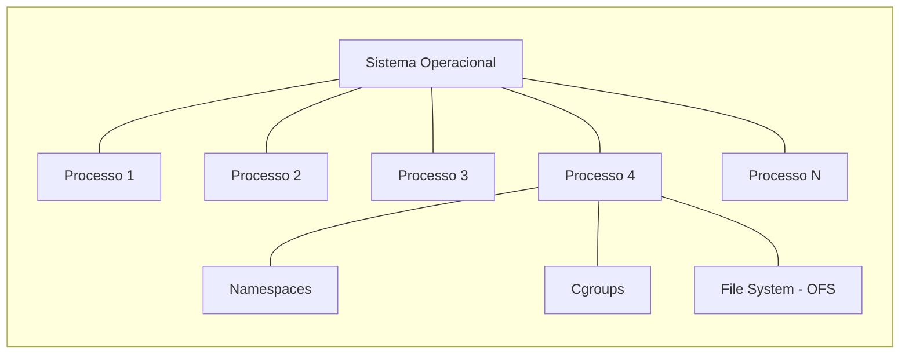

O overlay file system funciona da seguinte maneira: imagine que você tenha um container no qual está executando sua aplicação, que ocupa 700 MB. No entanto, sua aplicação possui duas dependências, cada uma com seu tamanho próprio. Por exemplo, suponha que a dependência A tenha 200 MB e a dependência B tenha 250 MB. Nesse caso, teríamos algo parecido com o seguinte:

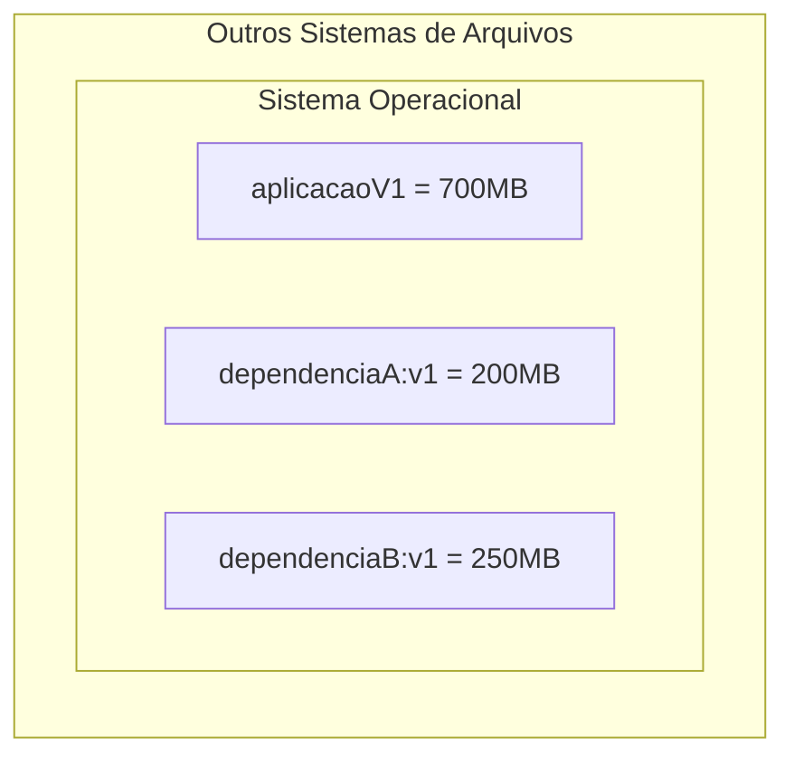

Imagine que você esteja executando isso em uma máquina virtual. A máquina virtual é uma cópia fiel de todos os elementos contidos nela. Portanto, se você aumentar o tamanho desses itens e gerar uma nova imagem, o tamanho da máquina virtual também aumentará. Além disso, ao criar um snapshot, será realizado um processo integral de cópia, capturando todos os componentes da máquina virtual no momento da criação do snapshot.

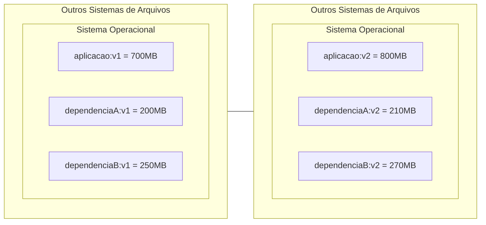

O Overlay File System (OFS) melhora significativamente a questão do armazenamento em containers. Ele utiliza camadas para armazenar apenas as diferenças parciais. Com o OFS, não é necessário criar cópias completas da máquina virtual. Em vez disso, camadas adicionais são criadas incrementalmente para cada modificação no sistema de arquivos do container. Isso resulta em um consumo de espaço mais eficiente e um processo de criação de container mais rápido. Além disso, o uso de camadas permite o compartilhamento entre containers, otimizando ainda mais o uso de recursos. O OFS contribui para a eficiência e velocidade dos containers, reduzindo o impacto no armazenamento e nos recursos computacionais.

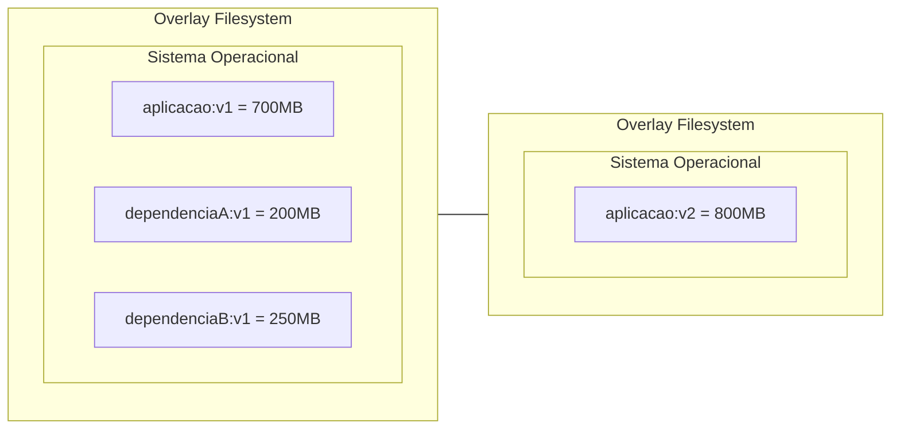

Os containers são extremamente leves, pois não exigem cópias completas do sistema operacional. Eles aproveitam o kernel, bibliotecas e outros componentes do sistema operacional subjacente. Apenas os recursos necessários para o funcionamento do aplicativo são incluídos no container, resultando em um consumo eficiente de recursos. Isso torna os containers rápidos para implantar, escalar e mover entre ambientes de computação. A leveza dos containers proporciona melhor aproveitamento de recursos e eficiência no desenvolvimento e implantação de aplicativos.

## O que são imagens docker ?

Os containers trabalham com imagens, que são partes de um todo. Quando um container Docker é executado, ele não precisa do conjunto completo da imagem, mas sim de uma imagem base que contenha o mínimo necessário para sua execução. Essa imagem base, que fornece apenas os elementos essenciais para o funcionamento do container, é conhecida como "scratch".

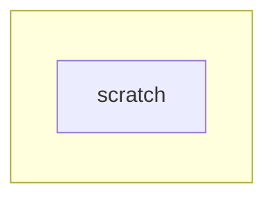

Agora, imagine que você queira que seu container execute uma distribuição Ubuntu. Nesse caso, a partir da imagem "scratch", o Docker irá criar um container baseado na imagem do Ubuntu.

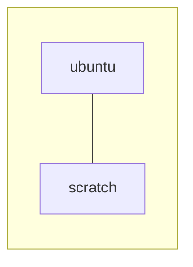

Porém, nesse Ubuntu, você deseja executar comandos no shell, como no bash, por exemplo.

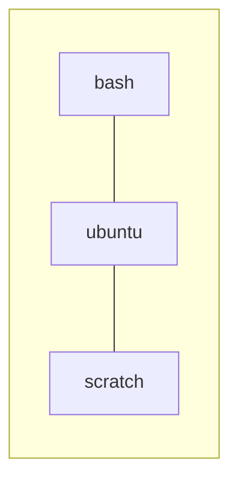

Agora, imagine que você também deseja que o Ubuntu execute o serviço SSH (ssh.d).

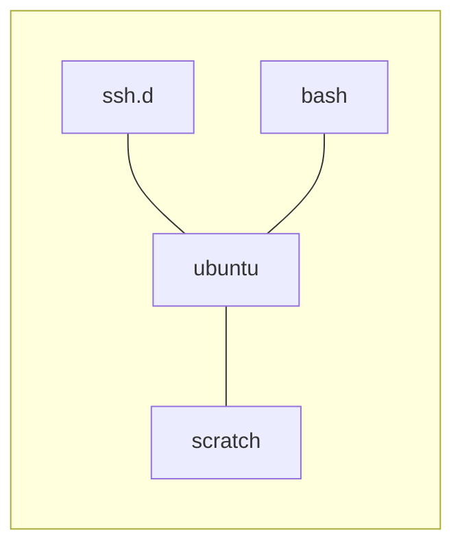

E, por fim, suponha que você tenha uma aplicação que roda sobre o serviço SSH (ssh.d). Dessa forma, teríamos algo mais ou menos assim:

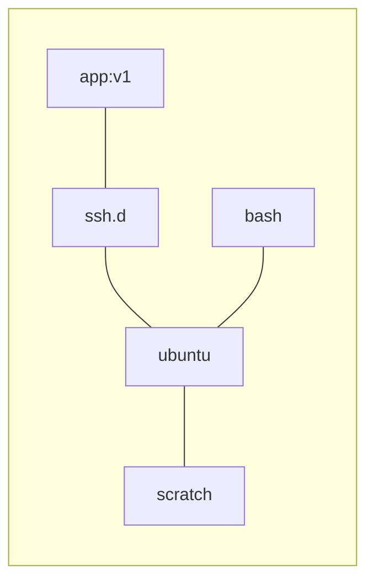

As dependências de um aplicativo são organizadas em camadas separadas. Outros containers podem aproveitar as camadas de dependências já disponibilizadas, tornando-se mais leves. Se houver algum problema na imagem do Ubuntu, apenas essa camada precisa ser reconstruída, sem afetar as outras partes. Isso é diferente de um sistema operacional tradicional ou máquina virtual, onde a modificação em uma parte afetaria todo o sistema.

Exemplo de uma imagem docker:

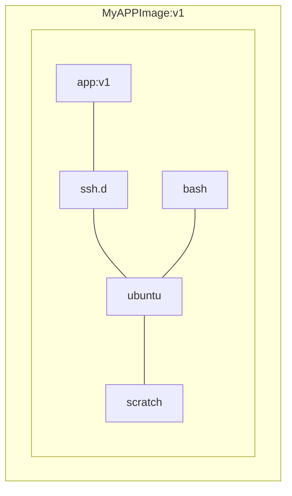

Uma imagem Docker geralmente é identificada por um nome e uma versão. Essa nomenclatura segue o formato `<nome>:<versão>`. Por exemplo, "ubuntu:22.0.5" é o nome da imagem do Ubuntu com a versão 22.0.5, e "grafana:latest" é o nome da imagem do Grafana na versão mais recente disponível.

O nome da imagem é usado para identificar qual imagem específica será usada para construir e executar um container. A versão, por sua vez, indica a versão específica da imagem que está sendo utilizada. A versão pode ser um número ou um identificador alfanumérico, como "latest" para indicar a versão mais recente disponível.

Essa nomenclatura de nome e versão ajuda a garantir a consistência e o controle de versões nas imagens Docker, permitindo que os desenvolvedores especifiquem exatamente qual imagem desejam utilizar em seus ambientes de desenvolvimento, teste e produção.

## Dockerfile

Para criar imagens, precisamos de um arquivo declarativo no qual dizemos o que queremos criar.

Esse arquivo é chamado de "Dockerfile".

Em um Dockerfile, a primeira coisa que devemos dizer é qual é o nosso ponto de partida, ou seja, qual é a nossa imagem base. Para isso, utilizamos a palavra "FROM".

Sintaxe:

```Dockerfile
FROM:   ImageName
```

Também podemos personalizar essa imagem, o que podemos fazer por meio de comandos. Para executar comandos, utilizamos a palavra reservada "RUN".

Sintaxe:

```Dockerfile
FROM:   ImageName
RUN:    Comandos ex: apt-get install
```

Também é possível expor portas dessa imagem para que tenhamos acesso a elas. Fazemos isso com o comando "EXPOSE".

Sintaxe:

```Dockerfile
FROM:   ImageName
RUN:    Comandos ex: apt-get install
EXPOSE: 8080
```

Exemplo de Dockerfile:

```Dockerfile
FROM gradle:7.1.1-jdk11 AS TEMP_BUILD_IMAGE

ENV APP_HOME=/usr/app

WORKDIR $APP_HOME

COPY build.gradle settings.gradle gradlew $APP_HOME/
COPY gradle $APP_HOME/gradle
COPY . .

RUN ./gradlew clean build

FROM openjdk:11

ENV ARTIFACT_NAME=todolist-0.0.1-SNAPSHOT.jar

ENV APP_HOME=/usr/app

WORKDIR $APP_HOME

COPY --from=TEMP_BUILD_IMAGE $APP_HOME/build/libs/todolist-0.0.1-SNAPSHOT.jar .

EXPOSE 8000

ENTRYPOINT ["java", "-jar", "todolist-0.0.1-SNAPSHOT.jar"]
```

IMPORTANTE: O único propósito de um "Dockerfile" é construir imagens. Se você não precisa personalizar uma imagem, então não precisa de um Dockerfile.

## Camada de Read / Write e Imutabilidade

Os containers consistem em processos executando uma imagem imutável, o que os torna rápidos e leves. Os arquivos e dados escritos dentro de um container são efêmeros e serão perdidos quando o processo do container for encerrado. O container possui camadas de leitura e escrita isoladas, chamadas de camadas de read/write, permitindo a modificação apenas dessas camadas, não da imagem em si.

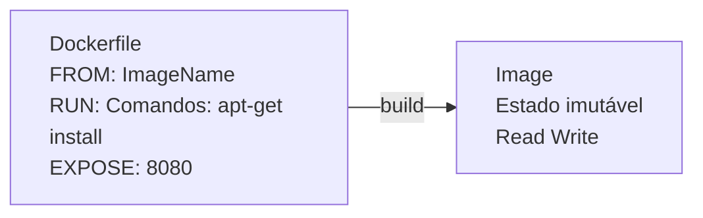

## Commit, Pull e Push

Agora, vamos imaginar que a minha imagem esteja sendo executada dentro do meu container e que eu escreva algo na área de escrita desse container e queira salvar essas alterações. Para isso, posso fazer um commit e gravar apenas as diferenças entre uma versão e outra.

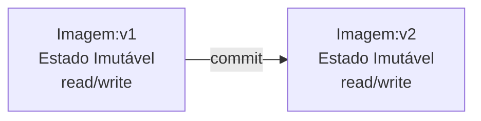

Perceba que é possível gerar uma imagem com base no Dockerfile ou pegar um container em execução, escrever dentro dele na camada de escrita (write) e, ao fazer um commit, será gerada uma nova imagem a partir das alterações feitas na camada de leitura e escrita (read/write).

Essa camada de leitura e escrita (read/write) se torna parte de uma nova imagem.

Toda vez que eu gero uma nova imagem com o meu Dockerfile, essa imagem é obtida de um registro (registry). Em outras palavras, estou realizando um pull.

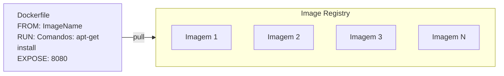

Porém, ao construir (build) de uma imagem, o que fazemos é um push para o registro de imagens (image registry).

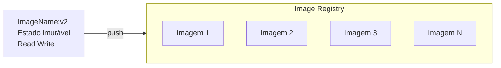

## Docker Host - Docker Client e Registry

As imagens dos nossos container ficam armazenadas em um `registry`

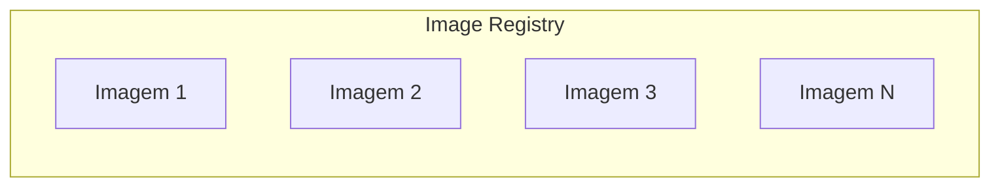

Em resumo, o Docker é uma integração entre namespaces, cgroups e sistema de arquivos (file system). Com base nesses três pilares, o Docker criou um conceito chamado "Docker host".

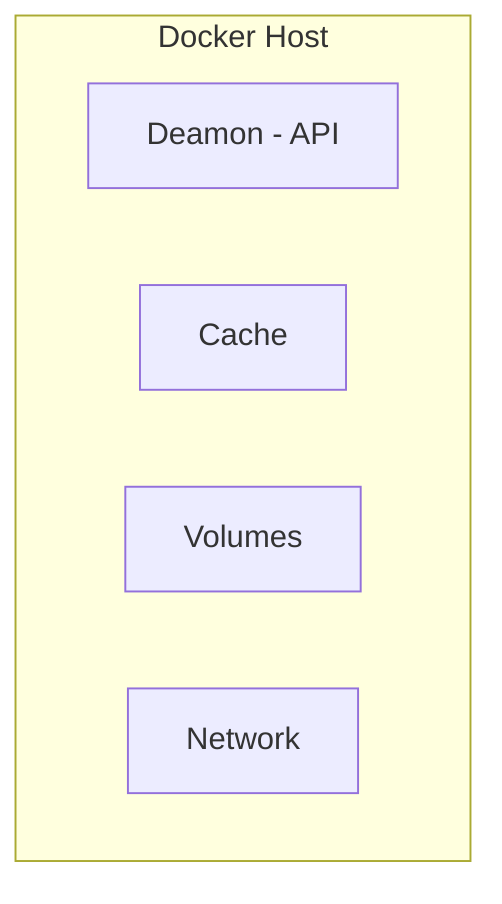

O Docker funciona com um processo em segundo plano (daemon) no sistema operacional, que disponibiliza uma API para interagir com ele. Utilizamos um cliente Docker para realizar diversas ações e o Docker host interage com o registro (registry). O Docker host utiliza uma camada de cache para evitar downloads constantes ao fazer pull ou push de imagens através do cliente Docker.

```mermaid
graph LR;
    subgraph ide1 [Docker Host]
        deamon[Deamon - API]
        cache[Cache]
        volumes[Volumes]
        network[Network]
    end
    subgraph ide2[Docker Client]
        dockerclient[- Containers\n- RUN, PUSH, PULL...\n- Volumes]:::left
    end
    subgraph ide3[Docker Registry]
    end
    ide2-->deamon
    cache--pull/push-->ide3

classDef left text-align:left;
```

O Docker possui recursos de gerenciamento de volumes para compartilhar diretórios entre a máquina e os containers, permitindo persistência de dados. A rede dos containers possibilita a comunicação entre eles, garantindo a troca de informações. Agora que você entende a teoria do Docker, pode prosseguir para a instalação.

## Para pensar

1. O que são namespaces ?
2. O que são cgroups ou control groups ?
3. Quais são os 3 pilares fundamentais utilizados pelo Docker ?
4. Qual o tipo de sistema de arquivos que os containers utilizam ?
5. O que é pra que servem Docker Host - Docker Client e Registry ?
6. O que é e pra que serve o Dockerfile ?
7. Pra que serve a intrução FROM no Dockerfile ?
8. Pra que serve a intrução RUN no Dockerfile ?
9. Pra que serve a intrução EXPOSE no Dockerfile ?
10. Do que é composto um Docker Host ?

## Referências

https://docs.docker.com/get-started/what-is-a-container/#:~:text=A%20container%20is%20an%20isolated,to%20you%20by%20Docker%20Desktop.

https://access.redhat.com/documentation/en-us/red_hat_enterprise_linux/6/html/resource_management_guide/ch01