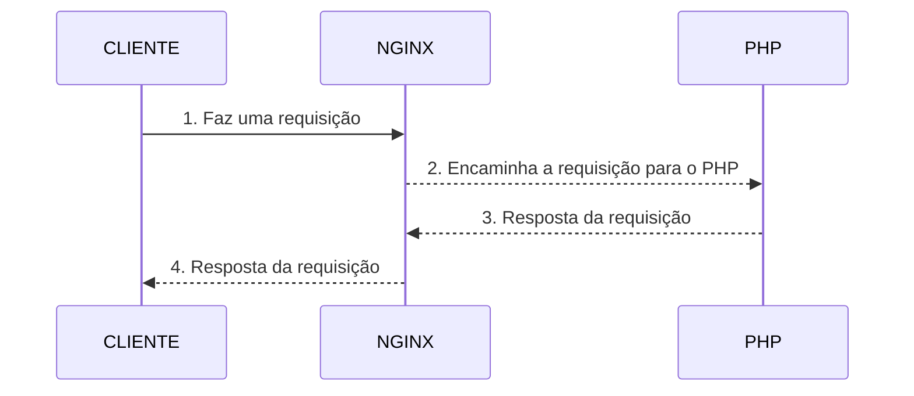

# Otimizando imagens docker com multi stage building

## Objetivo

Reduzir o tamanho de uma imagem para ser utilizada em um container docker.

## Ponto de partida

[Nesse artigo](https://www.tabnews.com.br/seujorge/instalando-um-framework-em-um-container-docker-exemplo-com-laravel) anterior nós instalamos o laravel e geramos uma imagem.

Vamos revisitar o Dockerfile dessa imagem

```Dockerfile
FROM php:7.4-cli

WORKDIR /var/wwww

RUN apt-get update && \
    apt-get install libzip-dev -y && \
    docker-php-ext-install zip

RUN php -r "copy('https://getcomposer.org/installer', 'composer-setup.php');" && \
    php -r "if (hash_file('sha384', 'composer-setup.php') === 'e21205b207c3ff031906575712edab6f13eb0b361f2085f1f1237b7126d785e826a450292b6cfd1d64d92e6563bbde02') { echo 'Installer verified'; } else { echo 'Installer corrupt'; unlink('composer-setup.php'); } echo PHP_EOL;" && \
    php composer-setup.php && \
    php -r "unlink('composer-setup.php');"

RUN php composer.phar create-project --prefer-dist laravel/laravel laravel

ENTRYPOINT [ "php", "laravel/artisan", "serve" ]

CMD [ "--host=0.0.0.0" ]
```

Quando utilizamos uma imagem de container em produção queremos que essa imagem fique com o menor tamanho possível, essa imagem está com 554 MB e queremos reduzir seu tamanho.

```bash
docker images

REPOSITORY                    TAG       IMAGE ID       CREATED             SIZE
jorgerabello/custom-laravel   latest    2a1abc76bf27   About an hour ago   554MB
```

Note que a nossa imagem base é a php:7.4-cli, porém podemos utilizar uma imagem base baseada em um linux muio enxuto chamado alpine.

## Multi stage building

Multi stage building nada mais é do que uma técnica que separa o build de uma imagem em partes, assim podemos separar algumas operações fazendo co que nossa imagem final seja bastante reduzida.

Sendo assim vamos editar o nosso Dockerfile da seguinte forma

```Dockerfile
# estágio 1 instalação do laravel

# imagem base php:7.4-cli AS build aqui demos um nome a esse estágio chamando ele de build
FROM php:7.4-cli AS build

# definimos o workdir em /var/wwww
WORKDIR /var/wwww

# fazemos a instalação das dependências
RUN apt-get update && \
    apt-get install libzip-dev -y && \
    docker-php-ext-install zip

# instalamos o composer
RUN php -r "copy('https://getcomposer.org/installer', 'composer-setup.php');" && \
    php -r "if (hash_file('sha384', 'composer-setup.php') === 'e21205b207c3ff031906575712edab6f13eb0b361f2085f1f1237b7126d785e826a450292b6cfd1d64d92e6563bbde02') { echo 'Installer verified'; } else { echo 'Installer corrupt'; unlink('composer-setup.php'); } echo PHP_EOL;" && \
    php composer-setup.php && \
    php -r "unlink('composer-setup.php');"

# executamos o laravel
RUN php composer.phar create-project --prefer-dist laravel/laravel laravel

# definimos o entrypoint
ENTRYPOINT [ "php", "laravel/artisan", "serve" ]

# e também demos a opção de quem utilizar essa imagem passar parâmetros para ela como host e porta
CMD [ "--host=0.0.0.0" ]

# estágio 2
# vamos utilizar uma imagem bastante enxuta do php
FROM php:7.4-fpm-alpine

# definimos o diretório de trabalho para /var/www
WORKDIR /var/www

# vamos remover o diretório /var/www/html que é inútil pra nós
RUN rm -rf /var/www/html

# aqui fazemos a cópia de tudo que rolou no estágio de build para o workdir atual
COPY --from=build /var/wwww/laravel .

# estamos dizendo que o usuário www-data e o grupo www-data agora são donos do diretório /var/www
RUN chown -R www-data:www-data /var/www

# cria um link símbolico entre public e html
RUN ln -s public html

# vamos expor a porta 9000
EXPOSE 9000

# e executar o php-fpm que deve ficar ouvindo na porta 9000
CMD [ "php-fpm" ]
```

Agora vamos fazer um build da nossa imagem e ver qual o tamanho dela

```bash
docker images

REPOSITORY                    TAG       IMAGE ID       CREATED         SIZE
jorgerabello/custom-laravel   latest    306bfbfb321f   4 seconds ago   141MB
```

Note que a imagem anterior havia ficado com 554 MB e a nova imagem ficou com apenas 141 MB.

## Bônus - executando o nginx como proxy reverso

Aqui a ideia é fazer com que o nginx funciona como um proxy para as requisições que serão realizadas ao container do php, algo mais ou menos assim:



### Organizando a casa

Para que a estrutura de diretório fique organizada, vamos fazer o seguinte, vamos criar um diretório chamado laravel e mover o Dockerfile para dentro desse diretório

```bash
mkdir laravel && mv Dockerfile laravel
```

Vamos criar um segundo diretório chamado nginx e criar dentro desse diretório um arquivo chamado nginx.conf e um Dockerfile

```bash
mkdir nginx && touch nginx/Dockerfile && touch nginx/nginx.conf
```

Nossa estrutura de diretório deve ficar assim

```bash
.
├── laravel
│   └── Dockerfile
└── nginx
    ├── Dockerfile
    └── nginx.conf
```

Podemos verificar no site do laravel como configurar o nginx como proxy reverso, [nessa documentação](https://laravel.com/docs/10.x/deployment#nginx).

Sendo assim vamos adaptar o nosso arquivo `nginx.conf` da seguinte forma:

```conf
server {
    listen 80;
    listen [::]:80;
    server_name example.com;
    root /var/www/html;

    add_header X-Frame-Options "SAMEORIGIN";
    add_header X-XSS-Protection "1; mode=block";
    add_header X-Content-Type-Options "nosniff";

    index index.php;

    charset utf-8;

    location / {
        try_files $uri $uri/ /index.php?$query_string;
    }

    location = /favicon.ico { access_log off; log_not_found off; }
    location = /robots.txt  { access_log off; log_not_found off; }

    error_page 404 /index.php;

    location ~ \.php$ {
        fastcgi_split_path_info ^(.+\.php)(/.+)$;
        fastcgi_pass laravel:9000;
        fastcgi_param SCRIPT_FILENAME $realpath_root$fastcgi_script_name;
        include fastcgi_params;
    }

    location ~ /\.(?!well-known).* {
        deny all;
    }
}
```

Agora abra o Dockerfile que está no diretório nginx e edite da seguinte forma:

```Dockerfile
# usaremos a imagem nginx:1.15.0-alpine como base
FROM nginx:1.15.0-alpine

# aqui estamos removendo o arquivo de configuração padrão do nginx
RUN rm -rf /etc/nginx/conf.d/default.conf

# e estamos copiando o nosso arquivo nginx.conf para o diretório onde ficam os arquivos de configuração do nginx
COPY /nginx/nginx.conf /etc/nginx/conf.d

# para que o nginx funcione precisamos ter um arquivo index.php então vamos criá-lo
RUN mkdir /var/www/html -p && touch /var/www/html/index.php
```

### Build

Vamos buildar a imagem do nginx e do php

```bash
docker build -f laravel/Dockerfile -t jorgerabello/custom-laravel:latest .
```

```bash
docker build -f nginx/Dockerfile -t jorgerabello/custom-nginx:latest .
```

### Criando a rede

Para que os containers possam se comunicar vamos criar uma rede para eles

```bash
docker network create devnet
```

### Rodando

Por fim vamos executar os containers com as imagens acima

```bash
docker run -d --network devnet --name laravel jorgerabello/custom-laravel:latest
```

```bash
docker run -d --network devnet --name nginx -p 8080:80 jorgerabello/custom-nginx:latest
```

Agora basta acessar http://localhost:8080/ no nvageador ou via curl

### Publicando as imagens

Agora que nossas imagens estão estáveis, por fim, vamos publicar elas

```bash
docker images

REPOSITORY                    TAG       IMAGE ID       CREATED         SIZE
jorgerabello/custom-nginx     latest    c5d10cd2585b   8 minutes ago   18MB
jorgerabello/custom-laravel   latest    570f005e37fc   8 minutes ago   141MB
```

```bash
docker push jorgerabello/custom-laravel:latest
```

```bash
docker push jorgerabello/custom-nginx:latest
```