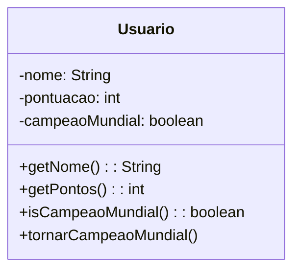

# Objetivo

Este é um artigo que tem por finalidade demonstrar de forma simples e efetiva as funcionalidades do Java 8 ! Apesar de ter tido seu primeiro release em 2014 (sim vão fazer 10 anos !) ainda vejo que é não é incomum encontrar desenvolvedores que ainda tem alguma dúvida a respeito do uso das funcionalidades que chegaram com essa hoje nem tão nova versão.

O objetivo desse artigo (ou série de artigos) será cobrir as principais funcionalidades, para uma lista completa consulte a lista com as features do Java 8 [aqui](https://openjdk.org/projects/jdk8/features).

# Funções Lambda

As funções lambda sem dúvida são uma das features mais interessantes do Java 8, mas o que diabos é uma função lambda ?

As funções lambda do Java 8 são expressões, ou funções anônimas que permitem escrever código conciso e funcionalmente mais elegante. Elas são usadas para representar comportamentos como argumentos de métodos, ou seja, como se fossem funções que podem ser passadas como parâmetros para outros métodos. As funções lambda permitem que o código seja mais legível e simplificado, reduzindo a necessidade de criar classes anônimas ou interfaces funcionais.

# Loops

Vamos a um exemplo prático, considere o código a seguir:

```java
import java.util.Arrays;
import java.util.List;

public class ExemploLambda {
    public static void main(String[] args) {
        List<String> fruits = Arrays.asList("maçã", "banana", "abacaxi", "pera");

        for (String fruit : fruits) {
            System.out.println(fruit);
        }
    }
}
```

Estamos acostumados a esse código, nele fizemos um enhanced for ou foreach para percorrer uma lista, até aqui nenhuma novidade, apenas para demonstrar a estrutura de uma função lambda vamos alterar esse código:

```java
import java.util.Arrays;
import java.util.List;

public class ExemploLambda {
    public static void main(String[] args) {
        List<String> fruits = Arrays.asList("maçã", "banana", "abacaxi", "pera");
        fruits.forEach(fruit -> System.out.println(fruit));
    }
}
```

Aqui não há perdas, e ganhamos um código um pouco mais enxuto, apenas estamos alterando a forma de escrever código esse método `forEach()` recebe como argumento um Consumer e opera em cima dele,

```java
default void forEach(Consumer<? super T> action) {
    Objects.requireNonNull(action);
    for (T t : this) {
        action.accept(t);
    }
}
```

Esse consumer é uma interface funcional

```java
@FunctionalInterface
public interface Consumer<T> {
    void accept(T t);
}
```

Uma interface funcional é aquela que possui apenas um único método abstrato graças às interfaces funcionais, o Java 8 introduziu o suporte a funções lambda, que permitem escrever blocos de código concisos e expressivos, melhorando a legibilidade e a manutenibilidade do código. Além disso, o novo pacote `java.util.function` oferece diversas interfaces funcionais predefinidas, o que facilita a manipulação de funções e comportamentos em situações comuns de programação funcional.

Vamos demonstrar o uso de loops de uma outra forma, para isso vamos criar a classe de domínio `Piloto`, conforme abaixo



```java
public class Piloto {
    private String nome;
    private int pontuacao;
    private boolean campeaoMundial;

    public Piloto(String nome, int pontuacao) {
        this.nome = nome;
        this.pontuacao = pontuacao;
    }

    public Piloto(String nome, int pontuacao, boolean campeaoMundial) {
        this.nome = nome;
        this.pontuacao = pontuacao;
        this.campeaoMundial = campeaoMundial;
    }

    public String getNome() {
        return nome;
    }

    public int getPontuacao() {
        return pontuacao;
    }

    public boolean isCampeaoMundial() {
        return campeaoMundial;
    }

    public void tornarCampeaoMundial() {
        this.campeaoMundial = true;
    }

    @Override
    public String toString() {
        return this.nome;
    }
}
```

Agora vamos criar alguns pilotos:

```java
public class Main {
    public static void main(String[] args) {

        Piloto senna = new Piloto("Ayrton Senna", 1000);
        Piloto prost = new Piloto("Alain Prost", 10);
        Piloto gasly = new Piloto("Pierre Gasly", 908);

        List<Piloto> pilotos = Arrays.asList(senna, prost, gasly);
    }
}
```

Para percorrer a lista de pilotos podemos utilizar o método `forEach()` como vimos anteriormente.

```java
public class Main {
    public static void main(String[] args) {

        Piloto senna = new Piloto("Ayrton Senna", 1000);
        Piloto prost = new Piloto("Alain Prost", 10);
        Piloto gasly = new Piloto("Pierre Gasly", 908);

        List<Piloto> pilotos = Arrays.asList(senna, prost, gasly);

        pilotos.forEach(piloto -> System.out.println(piloto));
    }
}
```

Como nesse caso queremos apenas exibir os pilotos (dados da lista), podemos resumir o trecho do `forEach()` utilizando uma funcionalidade chamada **method refference** mais tarde vamos falar sobre isso, por hora apenas observe o código:

```java
public class Main {
    public static void main(String[] args) {

        Piloto senna = new Piloto("Ayrton Senna", 1000);
        Piloto prost = new Piloto("Alain Prost", 10);
        Piloto gasly = new Piloto("Pierre Gasly", 908);

        List<Piloto> pilotos = Arrays.asList(senna, prost, gasly);

        pilotos.forEach(piloto -> System.out.println(piloto));
    }
}
```

Poderíamos ser ainda mais sucintos e evitar a criação da lista, já que ela está sendo criada apenas para ser exibida:

```java
public class Main {
    public static void main(String[] args) {

        Piloto senna = new Piloto("Ayrton Senna", 1000);
        Piloto prost = new Piloto("Alain Prost", 10);
        Piloto gasly = new Piloto("Pierre Gasly", 908);

        Arrays.asList(senna, prost, gasly).forEach(System.out::println);

    }
}
```

Agora para entender como isso tudo está funcionando vamos escrever um códgo um pouco maior

```java
import java.util.Arrays;
import java.util.List;
import java.util.function.Consumer;

public class Main {
    public static void main(String[] args) {

        Piloto senna = new Piloto("Ayrton Senna", 1000);
        Piloto prost = new Piloto("Alain Prost", 10);
        Piloto gasly = new Piloto("Pierre Gasly", 908);

        List<Piloto> pilotos = Arrays.asList(senna, prost, gasly);

        Consumer<Piloto> mostrador = new Consumer<Piloto>() {
            @Override
            public void accept(Piloto piloto) {
                System.out.println(piloto);
            }
        };

        pilotos.forEach(mostrador);

    }
}
```

Como dito o `forEach()` recebe uma interface funcional chamada `java.util.function.Consumer` essa interface tem apenas um método chamado `accept()` e nesse método dizemos o que queremos fazer, nesse caso estamos escrevendo na saída padrão.

Não precisamos escrever todo esse código pois o compilador e a JVM são inteligentes o suficiente para interpretar da forma como escrevemos antes.Apenas para fins de curiosidade, esse código ainda pode ser reduzido, ficando assim:

```java
import java.util.Arrays;
import java.util.List;
import java.util.function.Consumer;

public class Main {
    public static void main(String[] args) {

        Piloto senna = new Piloto("Ayrton Senna", 1000);
        Piloto prost = new Piloto("Alain Prost", 10);
        Piloto gasly = new Piloto("Pierre Gasly", 908);

        List<Piloto> pilotos = Arrays.asList(senna, prost, gasly);

        Consumer<Piloto> mostrador = piloto -> System.out.println(piloto);

        pilotos.forEach(mostrador);

    }
}
```

# Interfaces Funcionais

As funções lambda no Java são apenas uma maneira simples de implementar uma interface, essa inteface deve ter apenas um único método. Se você reparou no código da interface `Consumer` viu que ela é uma interface funcional, pois possui apenas o método `accept()`, a interface ter apenas um método é um requisito para que o compilador consiga traduzi-la para uma expressão lambda.

```java
@FunctionalInterface
public interface Consumer<T> {
    void accept(T t);
}
```

Sendo assim toda interface do Java que possui apenas um método abstrato pode ser instanciada como um código lambda.

Veja por exemplo a interface Runnable:

```java
package java.lang;

@FunctionalInterface
public interface Runnable {
    public abstract void run();
}
```

Ela pode ser utilizada como interface funcional !

## Criando uma interface funcional

Vamos criar nossa própria interface fucnional, vamos fazer uma interface para um validador:

```java
public interface Validador<T> {
    boolean validar(T t);
}
```

Prontinho ! Temos a nossa interface funcional, vamos demosntrar sua utilização

```java
import br.com.jorgerabellodev.domain.model.Validador;

public class Main {
    public static void main(String[] args) {

        Validador<String> validadorDeCEP = new Validador<String>() {
            @Override
            public boolean validar(String cep) {
                return cep.matches("[0-9]{5}-[0-9]{3}");
            }
        };

        System.out.println(validadorDeCEP.validar("07094-10"));     // false
        System.out.println(validadorDeCEP.validar("07094-190"));    // true
    }
}
```

Porém como temos nossa interface funcional, podemos resumir esse código todo a uma função lambda !

```java
import br.com.jorgerabellodev.domain.model.Validador;

public class Main {
    public static void main(String[] args) {

        Validador<String> validadorDeCEP = cep -> cep.matches("[0-9]{5}-[0-9]{3}");

        System.out.println(validadorDeCEP.validar("07094-10"));     // false
        System.out.println(validadorDeCEP.validar("07094-190"));    // true
    }
}
```

Veja como temos um código muito mais enxuto agora.

Voltando ao código da nossa interface funcional, você deve estar se perguntando: "Ué ? Mas e aquela anotação `@FunctionalInterface` que vimos em `Consumer` e em `Runnable` ?

Essa anotação serve para duas coisas:

1. Explicitar que essa é uma interface funcional
2. Impedir que algum desavisado crie mais métodos nessa interface

Vamos testar, altere o código da nossa interface funcional adicionando a anotação

```java
@FunctionalInterface
public interface Validador<T> {
    boolean validar(T t);
}
```

E agora tente criar mais um método nela e você verá que vai ser impossível, pois o compilador vai acusar `Multiple non-overriding abstract methods found in interface br.com.jorgerabellodev.domain.model.Validador`

Além disso se você mesmo assim insistir e tentar executar o código vai receber algo mais ou menos assim:

```bash
> Task :compileJava FAILED

error: Unexpected @FunctionalInterface annotation

@FunctionalInterface
^
Validador is not a functional interface multiple non-overriding abstract methods found in interface Validador

FAILURE: Build failed with an exception.
```
