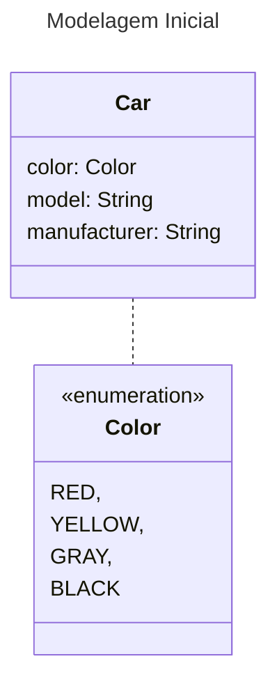
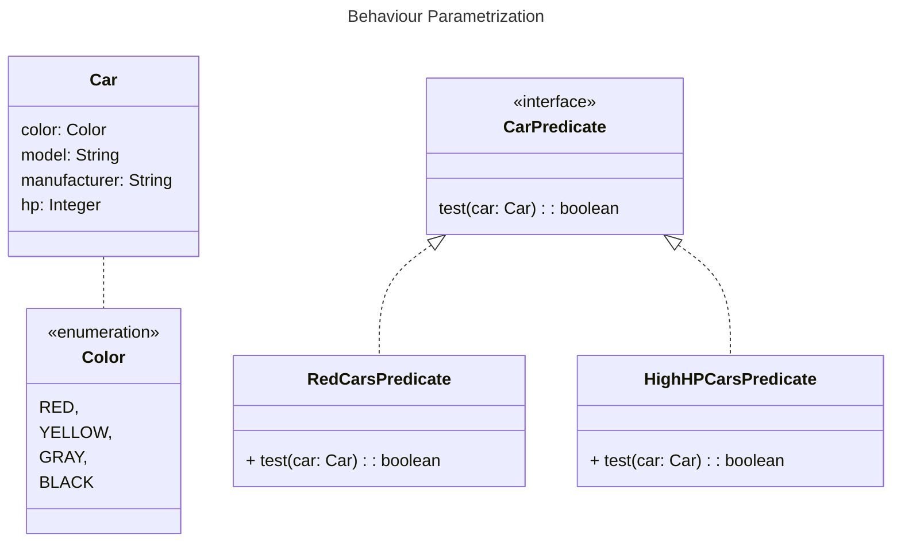
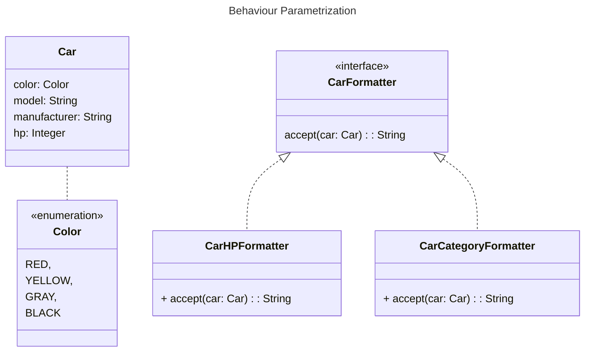

## Exemplo 1

Vamos imaginar que temos uma coleção de carros e queremos filtrar os carros pelas cores, a princípio podemos pensar no seguinte código:



Vamos ao código:

```java
public record Car(
  Color color,
  String model,
  String manufacturer
) {
}
```

```java
public enum Color {
  RED,
  YELLOW,
  GRAY,
  BLACK
}
```

```java
public static List<Car> filterRedCars(List<Car> collection) {
  List<Car> redCars = new ArrayList<>();
  for (Car car : collection) {
      if (Color.RED.equals(car.color())) {
          redCars.add(car);
          }
      }
  return redCars;
}
```

```java
public class Main {
  public static void main(String[] args) {

  List<Car> collection = asList(
    new Car(Color.RED, "Ferrari 488", "Ferrari"),
    new Car(Color.YELLOW, "Lamborghini Huracan", "Lamborghini"),
    new Car(Color.GRAY, "Porsche 911 GT3", "Porsche"),
    new Car(Color.BLACK, "McLaren 720S", "McLaren"),
    new Car(Color.RED, "Chevrolet Corvette", "Chevrolet"),
    new Car(Color.GRAY, "Audi R8", "Audi"),
    new Car(Color.RED, "Ford GT", "Ford"),
    new Car(Color.GRAY, "Bugatti Chiron", "Bugatti"),
    new Car(Color.YELLOW, "Ferrari LaFerrari", "Ferrari"),
    new Car(Color.RED, "Lamborghini Aventador", "Lamborghini")
  );

  List<Car> redCars = CarService.filterRedCars(collection);

  System.out.println("Cars Collection Size: " + collection.size());
  System.out.println("Total of Red Cars: " + redCars.size());
  System.out.println("Red Cars: " + redCars);
  }
}
```

Até aqui nenhuma novidade, porém a maior certeza que temos em relação a um software é que ele muda, e no nosso caso agora queremos filtrar os carros por outras cores, da forma como pensamos na solução teremos de escrever um método para cada cor e um novo pra cada cor que surgir e certamente estaríamos atropelando coisas como [DRY](https://en.wikipedia.org/wiki/Don%27t_repeat_yourself) e [KISS] (<https://en.wikipedia.org/wiki/KISS_principle>).

Sendo assim podemos repensar o método anterior para que ele consiga lidar com diversas cores:

```java
public static List<Car> filterCarsByColor(List<Car> collection, Color color) {
  List<Car> filteredCars = new ArrayList<>();
  for (Car car : collection) {
    if (color.equals(car.color())) {
      filteredCars.add(car);
    } 
  }
  return filteredCars;
}
```

```java
public class Main {
  public static void main(String[] args) {

  List<Car> collection = asList(
    new Car(Color.RED, "Ferrari 488", "Ferrari"),
    new Car(Color.YELLOW, "Lamborghini Huracan", "Lamborghini"),
    new Car(Color.GRAY, "Porsche 911 GT3", "Porsche"),
    new Car(Color.BLACK, "McLaren 720S", "McLaren"),
    new Car(Color.RED, "Chevrolet Corvette", "Chevrolet"),
    new Car(Color.GRAY, "Audi R8", "Audi"),
    new Car(Color.RED, "Ford GT", "Ford"),
    new Car(Color.GRAY, "Bugatti Chiron", "Bugatti"),
    new Car(Color.YELLOW, "Ferrari LaFerrari", "Ferrari"),
    new Car(Color.RED, "Lamborghini Aventador", "Lamborghini")
  );

  List<Car> redCars = CarService.filterCarsByColor(collection, Color.RED);
  List<Car> grayCars = CarService.filterCarsByColor(collection, Color.GRAY);

  System.out.println("Cars Collection Size: " + collection.size());
  System.out.println("Total of Red Cars: " + redCars.size());
  System.out.println("Red Cars: " + redCars);
  System.out.println("Total of Gray Cars: " + grayCars.size());
  System.out.println("Red Cars: " + grayCars);
  }
}
```

Veja que agora podemos filtrar qualquer cor, pois podemos passar a cor por parâmetro.

Mas vamos complicar um pouquinho as coisas, vamos adicionar ao nosso carro a sua potência em HP (Horse Power) ou em cavalos como falamos por aqui em terras tupiniquins.

```java
public record Car(
  Color color,
  String model,
  String manufacturer,
  Integer hp
) {
}
```

E ainda temos a nossa lista de carros:

```java
public class Main {
  public static void main(String[] args) {

  List<Car> collection = asList(
    new Car(Color.RED, "Ferrari 488", "Ferrari", 661),
    new Car(Color.YELLOW, "Lamborghini Huracan", "Lamborghini", 602),
    new Car(Color.GRAY, "Porsche 911 GT3", "Porsche", 500),
    new Car(Color.BLACK, "McLaren 720S", "McLaren", 710),
    new Car(Color.RED, "Chevrolet Corvette", "Chevrolet", 495),
    new Car(Color.GRAY, "Audi R8", "Audi", 532),
    new Car(Color.RED, "Ford GT", "Ford", 660),
    new Car(Color.GRAY, "Bugatti Chiron", "Bugatti", 1479),
    new Car(Color.YELLOW, "Ferrari LaFerrari", "Ferrari", 950),
    new Car(Color.RED, "Lamborghini Aventador", "Lamborghini", 730)
  );
```

E agora queremos filtrar os carros pela sua cor mas também pela sua potência em cavalos, sendo assim precisamos de mais um método, mais ou menos assim:

```java
public static List<Car> filterCarsByColor(List<Car> collection, Color color) {
  ...
}

public static List<Car> filterCarsByHP(List<Car> collection, Integer hp) {
  List<Car> filteredCars = new ArrayList<>();
  for (Car car : collection) {
    if (car.hp().equals(hp)) {
      filteredCars.add(car);
    }
  }
  return filteredCars;
}
```

Veja que essa ainda não é a melhor solução por que nesse caso praticamente duplicamos o método anterior, alterando somente a condição do filtro, o que viola um padrão chamado DRY.

E se você precisar mudar a forma como percorrer a coleção de carros ? Você teria de alterar a implementação em vários métodos, de uma perspectiva de esforço de engenharia isso seria caro.

Uma possível solução (bem infeliz, eu diria) seria combinar cor e hp em um só método chamado `filter()`, mas você ainda precisaria diferenciar qual atributo você quer filtrar.

Você poderia adicionar uma flag para diferenciar a consulta por cor e hp, mas nunca faça isso, veja por que:

```java
public static List<Car> filterCarsByColor(List<Car> collection, Color color) {
  ...
}

public static List<Car> filterCarsByHP(List<Car> collection, Integer hp) {
  ...
}

public static List<Car> filterCars(List<Car> collection, Color color, Integer hp, boolean flag) {
  List<Car> filteredCars = new ArrayList<>();
  for (Car car : collection) {
    if (flag && car.color().equals(color) || (!flag && car.hp() >= hp)) {
      filteredCars.add(car);
      }
    }
  return filteredCars;
}
```

Esse método funciona da seguinte forma, se a flag for `true` faz o filtro por cor, se for `false` faz o filtro por hp e esse método vai ser  utilizado assim:

```java
public class Main {
  public static void main(String[] args) {
    List<Car> collection = asList(
      new Car(Color.RED, "Ferrari 488", "Ferrari", 661),
      new Car(Color.YELLOW, "Lamborghini Huracan", "Lamborghini", 602),
      new Car(Color.GRAY, "Porsche 911 GT3", "Porsche", 500),
      new Car(Color.BLACK, "McLaren 720S", "McLaren", 710),
      new Car(Color.RED, "Chevrolet Corvette", "Chevrolet", 495),
      new Car(Color.GRAY, "Audi R8", "Audi", 532),
      new Car(Color.RED, "Ford GT", "Ford", 660),
      new Car(Color.GRAY, "Bugatti Chiron", "Bugatti", 1479),
      new Car(Color.YELLOW, "Ferrari LaFerrari", "Ferrari", 950),
      new Car(Color.RED, "Lamborghini Aventador", "Lamborghini", 730)
    );

    List<Car> carsFilteredByColor = CarService.filterCars(collection, Color.RED, 900, true);
    List<Car> carsFilteredByHP = CarService.filterCars(collection, Color.RED, 900, false);

    System.out.println(carsFilteredByColor);
    System.out.println(carsFilteredByHP);
  }
}
```

Essa solução é horrenda, é horrorosa, primeiro por que o código cliente é péssimo, o que exatamente true e false fazem ? Segundo que essa solução não é adequada a mudança de requisitos, por exemplo e se você precisar filtrar por diferentes atributos como por exemplo pelo fabricante, modelo, tipo de motor e etc... ? Além disso e se você precisar fazer consultas mais complexas que precisem combinar atributos como carros verdes que também tem mais de 600 HP ? Nesse caso você teria muitos métodos duplicados ou um pavoroso, complexo e enorme método único.

## Aplicando behaviour parametrization

Agora que você viu como fazer do jeito errado, e eu espero que você nunca mais escreva um código assim, vamos dar um passo atras e encontrar um nível melhor de abstração.

Nesse exemplo você está trabalhando com carros e retornando um booleano baseado em alguns atributos dos carros.

Por exemplo: É verde ? Tem mais de 600 HP ?

Nós chamamos isso de **predicado** (uma função que retorna um booleano), uma condição.

Então sabendo disso, vamos definir uma interface para o modelo de seleção de critério:



```java
public interface CarPredicate {
  boolean test(Car car);
}
```

```java
public class HighHPCarsPredicate implements CarPredicate {
  @Override
  public boolean test(Car car) {
    return car.hp() >= 900;
  }
}
```

```java
public class RedCarsPredicate implements CarPredicate{
  @Override
  public boolean test(Car car) {
    return Color.RED.equals(car.color());
  }
}
```

Note que implementamos algo parecido com o design pattern _strategy_, que permite definir uma familia de algorítimos, encapsular cada algorítmo (strategy), e escolher um algorítmo em tempo de execução.

Nesse caso a família de algorítmos é a interface `CarPredicate` e as estratégias são as classes `HighHPCarsPredicate` e `RedCarsPredicate`.

Vamos ver agora como fazer uso das diferentes implementações de `CarPredicate`. Pra isso você precisa que seu método de filtrar aceite um `CarPredicate` pra testar uma condição em um carro.

É exatamente isso que `Behaviour Parametrization` significa: A habilidade de dizer ao método para pegar diferentes comportamentos (ou estratégias) como parâmetros e usa-los internamente para avaliar diferentes comportamentos.

Para utilizar esse exemplo precisamos adicionar um parâmetro ao método `filterCars()` para que receba um `CarPredicate`.

O grande benefício aqui é que agora podemos separar a lógica de iteração com da coleção dentro do método `filterCars()` com o comportamento que queremos aplicar para cada elemento da coleção (nese caso um predicado).

Sendo assim teremos o seguinte método:

```java
public static List<Car> filterCars(List<Car> collection, CarPredicate predicate) {
  List<Car> filteredCars = new ArrayList<>();
  for (Car car : collection) {
    if (predicate.test(car)) {
      filteredCars.add(car);
    }
  }
  return filteredCars;
}
```

Para usar nosso novo método ficou extremamente simples:

```java
public class Main {
  public static void main(String[] args) {

    List<Car> collection = asList(
      new Car(Color.RED, "Ferrari 488", "Ferrari", 661),
      new Car(Color.YELLOW, "Lamborghini Huracan", "Lamborghini", 602),
      new Car(Color.GRAY, "Porsche 911 GT3", "Porsche", 500),
      new Car(Color.BLACK, "McLaren 720S", "McLaren", 710),
      new Car(Color.RED, "Chevrolet Corvette", "Chevrolet", 495),
      new Car(Color.GRAY, "Audi R8", "Audi", 532),
      new Car(Color.RED, "Ford GT", "Ford", 660),
      new Car(Color.GRAY, "Bugatti Chiron", "Bugatti", 1479),
      new Car(Color.YELLOW, "Ferrari LaFerrari", "Ferrari", 950),
      new Car(Color.RED, "Lamborghini Aventador", "Lamborghini", 730)
    );

    List<Car> highHPCars = CarService.filterCars(collection, new HighHPCarsPredicate());
    List<Car> redCars = CarService.filterCars(collection, new RedCarsPredicate());

    System.out.println(highHPCars);
    System.out.println(redCars);
  }
}
```

Veja que agora podemos adicionar facilmente novos filtros sem nem se quer se preocupar em alterar o método `filterCars()`, dessa vez tiramos proveito do polimorfismo e aplicamos um dos princípios de `S.O.L.I.D.` o Open Closed Principle.

Veja que se você tiver de criar algo para filtrar carros amarelos bastaria criar uma classe que implemente `CarPredicate`

```java
public class YellowCarsPredicate implements CarPredicate {
  @Override
  public boolean test(Car car) {
    return Color.YELLOW.equals(car.color());
  }
}
```

E para aplicar:

```java
public class Main {
  public static void main(String[] args) {

    List<Car> collection = asList(
      new Car(Color.RED, "Ferrari 488", "Ferrari", 661),
      new Car(Color.YELLOW, "Lamborghini Huracan", "Lamborghini", 602),
      new Car(Color.GRAY, "Porsche 911 GT3", "Porsche", 500),
      new Car(Color.BLACK, "McLaren 720S", "McLaren", 710),
      new Car(Color.RED, "Chevrolet Corvette", "Chevrolet", 495),
      new Car(Color.GRAY, "Audi R8", "Audi", 532),
      new Car(Color.RED, "Ford GT", "Ford", 660),
      new Car(Color.GRAY, "Bugatti Chiron", "Bugatti", 1479),
      new Car(Color.YELLOW, "Ferrari LaFerrari", "Ferrari", 950),
      new Car(Color.RED, "Lamborghini Aventador", "Lamborghini", 730)
    );

    List<Car> highHPCars = CarService.filterCars(collection, new HighHPCarsPredicate());
    List<Car> redCars = CarService.filterCars(collection, new RedCarsPredicate());
    List<Car> yellowCars = CarService.filterCars(collection, new YellowCarsPredicate());

    System.out.println(highHPCars);
    System.out.println(redCars);
    System.out.println(yellowCars);
  }
}
```

Esse novo código é além de mais flexível se comparado a nossa primeira tentativa, ainda é mais legível e mais fácil de usar e mater, pois agora sempre que precisarmos de novas condições de filtro basta criarmos um novo predicado.

Por exemplo, pare pra pensar um pouco como você faria pra criar um filtro para carros vermelhos com mais de  700 HP ?

Bastaria criar um novo predicado, veja:

```java
public class RedCarOver700HP implements CarPredicate {
  @Override
  public boolean test(Car car) {
    return Color.RED.equals(car.color()) && car.hp() >= 700;
  }
}
```

E por fim utilizar o novo predicado:

```java
public class Main {
  public static void main(String[] args) {

    List<Car> collection = asList(
      new Car(Color.RED, "Ferrari 488", "Ferrari", 661),
      new Car(Color.YELLOW, "Lamborghini Huracan", "Lamborghini", 602),
      new Car(Color.GRAY, "Porsche 911 GT3", "Porsche", 500),
      new Car(Color.BLACK, "McLaren 720S", "McLaren", 710),
      new Car(Color.RED, "Chevrolet Corvette", "Chevrolet", 495),
      new Car(Color.GRAY, "Audi R8", "Audi", 532),
      new Car(Color.RED, "Ford GT", "Ford", 660),
      new Car(Color.GRAY, "Bugatti Chiron", "Bugatti", 1479),
      new Car(Color.YELLOW, "Ferrari LaFerrari", "Ferrari", 950),
      new Car(Color.RED, "Lamborghini Aventador", "Lamborghini", 730)
    );

    ...
    
    List<Car> highPerformanceRedCars = CarService.filterCars(collection, new RedCarOver700HP());

    ...

    System.out.println(highPerformanceRedCars);
  }
}
```

## Exemplo II

Tenha em mente agora que desejamos duas coisas:

1. Imprimir uma mensagem que diga que é um super carro ou que é um carro esportivo (vamos considerar que super carros possuem 900 HP ou mais)
2. Imprimir uma mensagem que mostre quantos HPs tem um determinado carro

Vamos começar definindo nossos formatadores:



```java
public interface CarPredicate {
  boolean test(Car car);
}
```

```java
public interface CarFormatter {
  String accept(Car car);
}
```

```java
public class CarHPFormatter implements CarFormatter {
  @Override
  public String accept(Car car) {
    return car.model() +  " is a car of " + car.hp() + " HPs";
  }
}
```

```java
public class CarCategoryFormatter implements CarFormatter {
  @Override
  public String accept(Car car) {
    String category = car.hp() >= 900 ? "super car" : "sport car";
    return car.model() + " is a " + category;
  }
}
```

Agora vamos criar um método para utilizarmos os formatadores:

```java
public static void printCar(List<Car> collection, CarFormatter formatter) {
  for (Car car : collection) {
    String output = formatter.accept(car);
    System.out.println(output);
  }
}
```

E agora basta usar:

```java
public class Main {
  public static void main(String[] args) {

    List<Car> collection = asList(
      new Car(Color.RED, "Ferrari 488", "Ferrari", 661),
      new Car(Color.YELLOW, "Lamborghini Huracan", "Lamborghini", 602),
      new Car(Color.GRAY, "Porsche 911 GT3", "Porsche", 500),
      new Car(Color.BLACK, "McLaren 720S", "McLaren", 710),
      new Car(Color.RED, "Chevrolet Corvette", "Chevrolet", 495),
      new Car(Color.GRAY, "Audi R8", "Audi", 532),
      new Car(Color.RED, "Ford GT", "Ford", 660),
      new Car(Color.GRAY, "Bugatti Chiron", "Bugatti", 1479),
      new Car(Color.YELLOW, "Ferrari LaFerrari", "Ferrari", 950),
      new Car(Color.RED, "Lamborghini Aventador", "Lamborghini", 730)
    );

    CarService.printCar(collection, new CarCategoryFormatter());
    CarService.printCar(collection, new CarHPFormatter());
  }
}
```

Bom pessoal na primeira parte desse artigo vimos como lidar com comportamentos diversos para um domínio preservando o código e mantendo ele fácil de ler e manter.

Porém nosso código ainda está bastante verboso [aqui na parte II](https://www.tabnews.com.br/seujorge/parametrizacao-de-comportamento-com-java-parte-ii) vamos ver como lidar com isso.
