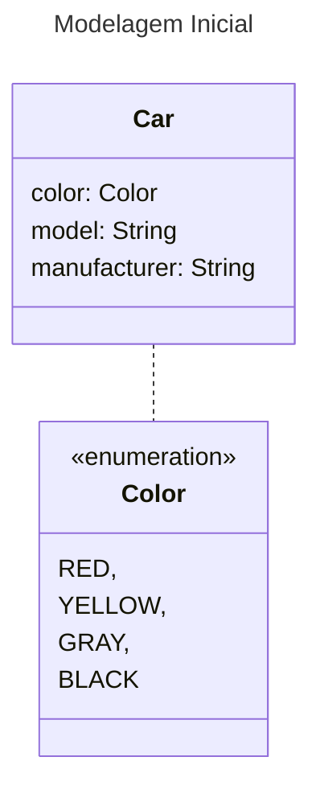

# Introdução a Expressões Lambda no Java

Nos artigos anteriores [aqui](https://www.tabnews.com.br/seujorge/parametrizacao-de-comportamento-com-java-parte-i) e [aqui](https://www.tabnews.com.br/seujorge/parametrizacao-de-comportamento-com-java-parte-ii) vimos como trabalhar com comportamentos parametrizados, porém fizemos isso utilizando utilizando classes anônimas que são extremamente verbosas tornam o uso de parametrização de compartamento um tanto quanto desafiador e não prático.

A boa notícia é que desde o Java 8 temos a solução pra esse problema, expressões lambda !

Nesse artigo vamos continuar utilizando o record `Car`  e a enum `Color`:



Vamos ao código:

```java
public record Car(
  Color color,
  String model,
  String manufacturer,
  Integer hp
) {
}
```

```java
public enum Color {
  RED,
  YELLOW,
  GRAY,
  BLACK
}
```

Uma expressão lambda pode ser entendida como uma representação concisa de uma função anônima que pode ser passada como parâmetro. As expressões lambda não tem um nome, mas tem uma lista de parâmetros, um corpo e um tipo de retorno e também pode ter possivelmente uma lista de exceções que podem ser lançadas.

Uma expressão lambda pode ser definida por ser:

**anonima:**

- Falamos isso pois as expressões lambda não tem um nome como um método normalmente teria - menos coisas para escrever e pra pensar, menos distrações !

**função:**

- Dizemos funçãop por que uma lambda não está associada com uma classe em particular, como os métodos estão. Mas da mesma forma que um método, uma lambda tem uma lsita de parâmetros, um corpo, um tipo de retorno e uma possível lista de exceções que podem ser lançadas.

**transmitida:**

- Uma expressão lambda pode ser transmitida (passada) como um argumento para um método ou pode ser armazenada em uma variável.

**concise:**

- Você não precisa escrever um monte de código boilerplate como você faria se utilizasse classes anônimas.

## Utilizando expressões lambda

Como exemplo vamos dar uma olhada em como seria uma ordenação simples, utilizando `Comparator`

```java
Comparator<Car> byHP = new Comparator<Car>() {
  @Override
  public int compare(Car o1, Car o2) {
    return o1.hp().compareTo(o2.hp());
  }
};
```

Nesse exemplo estamos utilizando uma classe anônima, vamos ver como ficaria esse mesmo código utilizando uma expressão lamda:

```java
Comparator<Car> byHP = (Car o1, Car o2) -> o1.hp().compareTo(o2.hp());
```

OK agora que você concordou em admitir que esse código é melhor que o anterior, vamos entender como ele funciona:

## Dissecando expressões lambda

**(Car o1, Car o2)**

- Esses são os parâmetros da expressão lambda
- Na prática é uma lista de parâmetros que passamos para a expressão nesse caso os 2 carros que queremos comparar, pense nisso como os parâmetro que você passa ao método `compare()` de `Comparator`, veja: `compare(Car o1, Car o2)`.

**->**

- Chamamos esse operador de seta (arrow em inglês)
- A seta ou arrow separa a lista de parâmetros do corpo da expressão lambda.

**o1.hp().compareTo(o2.hp())**

- Esse é o corpo da expressão lambda
- No corpo da expressão lambda fazemos a comparação dos dois carros utilizando sua potência (hp)
- Considere essa pare como o corpo retorno de `Comparator` veja: `return o1.hp().compareTo(o2.hp());`

Vamos ver outros exemplo de expressões lambda:

```java
/**
 * Recebe um parâmetro String e 
 * retorna um int (tamanho da String) nesse caso
 * o retorno é implicíto
**/
(String s) -> s.length();
```

```java
/**
 * Recebe um parâmetro do tipo Car 
 * e retorna um booleano 
 * (true se o carro tiver mais de 600 HP)
 * **/
(Car car) -> car.hp() > 600;
```

```java
/**
 * Recebe dois parâmetros do tipo int 
 * e não retorna nada (void). 
 * No corpo dessa expressão lambda tem 2 declarações (statements)
 * **/
(int x, int y) -> {
  System.out.println("Result:");
  System.out.println(x + y);
}
```

```java
/**
 * Não recebe nenhum parâmetro 
 * e retorna um int 42
 * **/
() -> 42;
```

```java
/**
 * Recebe dois parâmetros do tipo Car e retorna 
 * um int que representa a comparação da potência
 * desses carros
 * **/
(Car c1, Car c2) -> c1.hp().compareTo(c2.hp());
```

A sintaxe básica de uma expressão lambda pode ser descrita da seguinte forma:

```java
(parametros) -> expressão
```

Ou caso hajam declarações (statements) no corpo da expressão lambda podemos utilizar chaves, chamamos essa expressão lambda de _block-style lambda_:

```java
(parametros) -> { statements; }
```

## Interfaces funcionais (Functional Interfaces)

No [artigo anterior](https://www.tabnews.com.br/seujorge/parametrizacao-de-comportamento-com-java-parte-ii) criamos uma interface para representar um predicado

```java
public interface Predicate<T> {
  boolean test(T t);
}
```

Por meio dassa interface pudemos parametrizar o comportamento do método `filter()`

```java
public static <T> List<T> filter(List<T> collection, Predicate<T> predicate) {
  List<T> filtered = new ArrayList<>();
  for (T t : collection) {
    if (predicate.test(t)) {
      filtered.add(t);
    }
  }
  return filtered;
}
```

Veja que nossa interface `Predicate` possui apenas um único método abstrato e isso faz dela uma interface funcional.

Então em outras palavras interfaces funcionais se caracterizam por ter apenas um único método abstrato.

Existem outras interfaces funcionais conhecidas e talvez você até já tenha utilizado algumas delas, veja alguns exemplos:

**java.util.Comparator**

```java
@FunctionalInterface
public interface Comparator<T> {
  int compare(T o1, T o2);
}
```

**java.lang.Runnable**

```java
@FunctionalInterface
public interface Runnable {
  public abstract void run();
}
```

**java.awt.event.ActionListener**

```java
public interface ActionListener extends EventListener {
  public void actionPerformed(ActionEvent e);
}
```

**java.util.concurrent.Callable**

```java
@FunctionalInterface
public interface Callable<V> {
  V call() throws Exception;
}
```

**java.security.PrivilegedAction**

```java
@FunctionalInterface
public interface PrivilegedAction<T> {
  T run();
}
```

Você deve estar se perguntando: E o que podemos fazer com interfaces funcionais ? Ou o que tem a ver interfaces funcionais com expressões lambda ?

Expressões lambda te permitem fazer a implementação de um método abstrato de uma interface funcional diretamente _inline_ e tratar toda a expressão como uma instância de uma interface funcional.

Ou seja você pode tratar toda a expressão lambda como uma implementação concreta da interface funcional.

Você pode conseguir a mesma coisa utilizando uma inner class anônima porém lembre-se da verbosidade que a utilização de uma classe anônima nos traz.

Vamos a alguns exemplos:

```java
// Usa uma expressão lambda
Runnable runnableOne = () -> System.out.println("HELLO 1 !");

// Usa uma classe anônima
Runnable runnableTwo = new Runnable() {
  @Override
  public void run() {
    System.out.println("HELLO 2 !");
    }
  };
}

public static void process(Runnable r) {
  r.run();
}

// Imprime "HELLO 1 !"
process(runnableOne);

// Imprime "HELLO 2 !"
process(runnableTwo);

// Imprime "HELLO 3 !"
proccess(() -> System.out.println("HELLO 3 !"));
```

Veja que independente de utilizarmos lambda ou classes anônimas temos os mesmos resultados.

## Function descriptor

A assinatura do método abstrato presente na interface funcional descreve a assinatura da expressão lambda. Chamamos o método abstrato de function descriptor (descritor de função). Por exemplo veja a interface funcional `Runnable`:

```java
@FunctionalInterface
public interface Runnable {
  public abstract void run();
}
```

Veja que a assinatura do método abstrato `run()` não recebe nenhum parâmetro e não retorna nada (void), sendo assim veja como utilizamos a expressão lambda:

```java
Runnable runnableOne = () -> System.out.println("HELLO 1 !");
```

Onde:

**()**
Diz que não há argumentos a serem passados

---

**->**  
Separa os argumento do corpo da expressão

---

**System.out.println("HELLO 1 !");**

Como o retorno é void então declaramos um statement

---

Lembre-se sempre que uma expressão lambda pode ser atribuída a uma varável, por exemplo

```java
Runnable runnableOne = () -> System.out.println("HELLO 1 !");
```

Ou passada como parâmetro para um método, desde que esse método esteja esperando como parâmetro uma interface funcional, veja:

```java
public static void process(Runnable r) {
  r.run();
}
```

Nesse caso o método `process()` espera como parâmetro `Runnnable` que é uma interface funcional, sendo assim podemos fazer o seguinte:

```java
proccess(() -> System.out.println("AWESOME !!!"))
```

## Anotação @FunctionalInterface

Veja que algumas interfaces funcionais possuem a anotação `@FunctionalInterface` e outras não, mas por quê ?

Uma interface funcional, pode existir sem a presença dessa anotação, ela serve apenas para explicitar que essa é uma interface funcional e previne que seja adicinado mais de um método abstrato na interface funcional, caso algum desavisado faça isso o compilador vai emitir um erro, veja só esse exemplo:

Considere nossa interface funcional `Predicate`:

```java
public interface Predicate<T> {
  boolean test(T t);
}
```

Anote ela com `@FunctionalInterface`

```java
@FunctionalInterface
public interface Predicate<T> {
  boolean test(T t);
}
```

E tente criar outro método abstrato tipo:

```java
@FunctionalInterface
public interface Predicate<T> {
  boolean test(T t);
  String print(T t);
}
```

Você verá a indicação de erro do compilador dizendo
`Multiple non-overriding abstract methods found in interface br.com.jorgerabellodev.carsapp.Predicate`

Outra coisa importante, a partir do JDK 8 foi implementada a feature de _deafult methods_ que basicamente permite que interfaces tenham métodos não abstratos.

Se lembra que quando falamos que o que caracteriza um interface funcional é que ela tenha apenas um método abstrato ? Isso significa que uma interface pode ter quantos métodos default forem necessários e deve ter apenas um método abstrato.

Veja por exemplo a interface funcional `Consumer<T>`

```java
@FunctionalInterface
public interface Consumer<T> {
  void accept(T t);
  
  default Consumer<T> andThen(Consumer<? super T> after) {
    Objects.requireNonNull(after);
    return (T t) -> { accept(t); after.accept(t); }
  }
}
```

Note que temos mais de um método mas somente accept é abstrato, andThen já é um _default method_ veremos o assunto _default method_ nos próximos artigos deste assunto.
